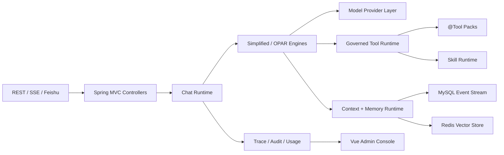

# SpringClaw

**Enterprise AI Agent Runtime for Spring Boot.**

SpringClaw is a production-oriented Java agent runtime built on Spring Boot 3.5 and Spring AI 1.1. It combines multi-model orchestration, memory, tool governance, skill execution, channel adapters, and an operations console into one backend-first platform for building auditable AI agents.

[](https://openjdk.org/)
[](https://spring.io/projects/spring-boot)
[](https://spring.io/projects/spring-ai)
[](https://vuejs.org/)
[](./LICENSE)

[中文文档](./README_CN.md) · [Runbook](./RUN_REAL_ENVIRONMENT.md) · [Changelog](./CHANGELOG.md) · [Script Skill Guide](./docs/SCRIPT_SKILL_GUIDE.md)

---

## Why SpringClaw

Most agent demos stop at a chat endpoint plus a few hard-coded tools. SpringClaw focuses on the platform layer that a long-running internal agent needs:

- **Model runtime** with provider/model switching, failover, streaming, async execution, and usage accounting.
- **Memory runtime** with MySQL-backed event history and Redis Vector Store semantic recall.
- **Tool governance** around Spring AI `@Tool`: permission checks, risk levels, rate limits, confirmation proposals, and audit logs.
- **Skill runtime** for directory-based `SKILL.md` packages with Python, builtin, and prompt-style skills.
- **Operations surface** with Vue 3 screens for users, roles, models, memory, cache, audit, sessions, and token usage.
- **Channel adapters** for REST API and Feishu/Lark, with extension points for Telegram and WeChat.

The result is a Spring-native foundation for building agents that can be observed, governed, and extended without turning every new capability into another service branch.

## Architecture



## Feature Matrix

| Area | What is included |
| --- | --- |
| Chat runtime | Synchronous, streaming SSE, and RabbitMQ-backed async chat APIs |
| Agent modes | Fast simplified mode plus OPAR-style Observe-Plan-Act-Reflect loop |
| Model orchestration | Multiple providers, runtime switching, health-aware fallback, token usage records |
| Memory | MySQL short-term event stream, Redis semantic memory, context assembly |
| Tool governance | Spring AI `@Tool` discovery, AOP guard, permissions, rate limits, audit logs |
| Action safety | Risk classification and confirmation proposals for write or side-effect actions |
| Skill platform | `SKILL.md` catalog, Python/builtin/prompt skills, usage sidecar, controlled script execution |
| Channels | REST API, Feishu webhook, Feishu long connection, adapter interfaces for more channels |
| Security | Token auth, HttpOnly cookies, role-based admin access, tool permission policies |
| Operations | Vue 3 admin console for model status, skills, memory, cache, audit, sessions, and usage |

## Quick Start

### Requirements

- JDK 17+
- Maven 3.8+
- Docker Desktop, optional but recommended for MySQL, Redis, and RabbitMQ

### Run Locally

```bash
OPENCLAW_PRIMARY_API_KEY=test-key mvn spring-boot:run
```

The service starts on `http://127.0.0.1:18080`. A real model key is optional for local exploration; when no usable model is configured, SpringClaw can still exercise local skills and fallback paths.

```bash
curl http://127.0.0.1:18080/actuator/health

curl -X POST http://127.0.0.1:18080/api/chat/send \
  -H 'Content-Type: application/json' \
  -d '{
    "sessionKey": "demo-1",
    "userId": "u1",
    "message": "Introduce SpringClaw in one paragraph",
    "channel": "api"
  }'
```

### Run With Docker Compose

```bash
OPENCLAW_PRIMARY_API_KEY=test-key docker compose up -d --build
```

This starts the application with MySQL 8, Redis Stack, and RabbitMQ. Use this mode when you want persistent chat events, vector memory, distributed locks, and async chat.

### Frontend Console

```bash
cd frontend
npm install
npm run dev
```

Open `http://localhost:5173/#/agent`. Vite proxies `/api/*` to the Spring Boot backend on port `18080`.

## Configuration

SpringClaw is configured through environment variables mapped in `src/main/resources/application.yml`.

| Variable | Purpose | Example |
| --- | --- | --- |
| `OPENCLAW_PRIMARY_API_KEY` | Primary model provider API key | `sk-...` |
| `OPENCLAW_CODING_PLAN_API_KEY` | Coding-plan provider key | `sk-...` |
| `OPENCLAW_DEEPSEEK_API_KEY` | DeepSeek provider key | `sk-...` |
| `OPENCLAW_EMBEDDING_API_KEY` | Embedding model key | `sk-...` |
| `OPENCLAW_EMBEDDING_MODEL` | Embedding model name | `text-embedding-v4` |
| `OPENCLAW_CHAT_AGENT_MODE` | Runtime mode | `simplified` or `opar` |
| `OPENCLAW_FEISHU_OUTBOUND_ENABLED` | Send replies back to Feishu | `true` |
| `OPENCLAW_FEISHU_LONG_CONNECTION_ENABLED` | Use Feishu long connection | `true` |
| `SPRING_PROFILES_ACTIVE` | Spring profile | `dev` or `prod` |

For a full production-style runbook, see [RUN_REAL_ENVIRONMENT.md](./RUN_REAL_ENVIRONMENT.md).

## API Overview

| Endpoint | Method | Description |
| --- | --- | --- |
| `/api/chat/send` | `POST` | Blocking chat completion |
| `/api/chat/stream` | `POST` | SSE streaming chat |
| `/api/chat/async` | `POST` | Submit async chat job |
| `/api/auth/register` | `POST` | Register account |
| `/api/auth/login` | `POST` | Login and issue token/cookie |
| `/api/auth/me` | `GET` | Current authenticated user |
| `/api/webhook/feishu` | `POST` | Feishu webhook ingress |
| `/admin` | `GET` | Vue admin console entry |

Additional examples live in [http/springclaw-api.http](./http/springclaw-api.http).

## Project Layout

```text
springclaw/
├── src/main/java/com/springclaw/
│   ├── controller/          # Chat, auth, admin, runtime, webhook endpoints
│   ├── service/
│   │   ├── chat/            # Chat orchestration and runtime engines
│   │   ├── ai/              # Provider management and model calls
│   │   ├── memory/          # Semantic memory, indexing, learning, frames
│   │   ├── context/         # Context assembly
│   │   ├── skill/           # Skill catalog, runtime, markdown/script support
│   │   ├── task/            # Scheduled and async task execution
│   │   └── usage/           # Model usage accounting
│   ├── runtime/             # Canonical runtime identity, lifecycle, memory contracts
│   ├── tool/                # Tool packs and guarded tool runtime
│   ├── strategy/channel/    # Channel adapters
│   ├── web/auth/            # Authentication and role interceptors
│   └── config/              # Spring, AI, cache, MQ, Redis, MyBatis config
├── frontend/                # Vue 3 + Vite operations console
├── skills/                  # Directory-based skill packages
├── data/                    # Local runtime data placeholders
├── docs/                    # Architecture notes, runbooks, skill docs
├── docker-compose.yml
├── Dockerfile
└── pom.xml
```

## Tech Stack

| Layer | Technology |
| --- | --- |
| Backend | Java 17, Spring Boot 3.5, Spring MVC, Spring AOP |
| AI | Spring AI 1.1, OpenAI-compatible providers, Redis Vector Store |
| Persistence | MySQL 8, MyBatis-Plus |
| Cache and locks | Redis Stack, Redisson |
| Messaging | RabbitMQ |
| Jobs | XXL-JOB |
| Channel SDK | Lark/Feishu OAPI |
| Frontend | Vue 3, Vite, TypeScript, Pinia, Vue Router, GSAP |
| Packaging | Maven, Docker, Docker Compose |

## Skill System

Skills live under `skills/` and are discovered from `SKILL.md` files. A skill package can be:

- **Python/script skill** for controlled local execution.
- **Builtin skill** implemented by the Java runtime.
- **Prompt skill** used as structured instruction and documentation.

The catalog exposes skill metadata without eagerly loading every support file. Script execution is opt-in and guarded by allowlists. See [docs/SCRIPT_SKILL_GUIDE.md](./docs/SCRIPT_SKILL_GUIDE.md) for the package format and operating rules.

## Roadmap

- Stabilize canonical run lifecycle storage and replay APIs.
- Expand runtime trace screens for tool calls, memory reads/writes, and model fallbacks.
- Harden skill import/export and permission review flows.
- Add more channel adapters and outbound delivery strategies.
- Publish deployment presets for small-team internal agent installations.

## Contributing

Contributions are welcome. Start with [CONTRIBUTING.md](./CONTRIBUTING.md), open an issue for non-trivial changes, and keep pull requests focused. Security reports should follow [SECURITY.md](./SECURITY.md).

## License

SpringClaw is released under the [MIT License](./LICENSE).
