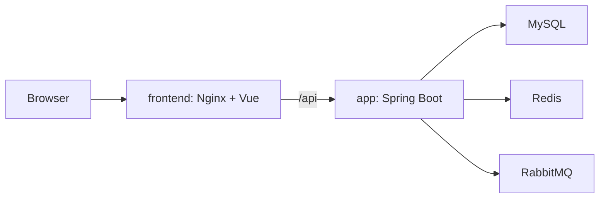

# SpringClaw

SpringClaw is a Spring Boot AI-agent runtime with governed tools, durable chat history, Redis-backed memory, model routing, and a Vue operations console. It can be run either as a fast native development environment or as a complete five-service Docker Compose delivery.

[中文说明](./README_CN.md) · [Operations runbook](./RUN_REAL_ENVIRONMENT.md) · [Changelog](./CHANGELOG.md) · [Skill guide](./docs/SCRIPT_SKILL_GUIDE.md)

## What runs in a delivery



The release Compose file exposes only the frontend HTTP port. The application, MySQL, Redis, and RabbitMQ remain on internal Docker networks. `docker-compose.dev.yml` is the development-only overlay that exposes the three dependencies on loopback for Maven and Vite.

## Prerequisites

- Docker Desktop with Docker Compose v2
- For native development: JDK 17+, Maven 3.8+, Node.js 22+ and npm

## Configure once

Create a private configuration file from the checked-in template. Never commit `.env`.

```bash
cp .env.example .env
```

Replace every infrastructure password placeholder, then review these settings:

| Setting | Why it matters |
| --- | --- |
| `MYSQL_ROOT_PASSWORD`, `MYSQL_PASSWORD`, `REDIS_PASSWORD`, `RABBITMQ_PASSWORD` | Required non-placeholder credentials for the stateful services. |
| `SPRINGCLAW_ADMIN_USERNAMES` | Comma-separated usernames that are granted `ADMIN` when they register. Keep `SPRINGCLAW_AUTH_BOOTSTRAP_FIRST_USER_ADMIN=false` for a real deployment. |
| `SPRINGCLAW_PASSWORD_PEPPER` | An optional, stable secret used while hashing passwords. Do not rotate it without a credential migration plan. |
| `SPRINGCLAW_HTTP_BIND_ADDRESS`, `SPRINGCLAW_HTTP_PORT` | The host binding of the Nginx frontend. Keep the default loopback binding unless a TLS proxy is in front of it. |
| `SPRINGCLAW_AUTH_COOKIE_SECURE` | Use `false` only for local HTTP. Set it to `true` behind HTTPS/TLS. |
| `SPRINGCLAW_WEBHOOK_SECURITY_ENABLED`, `SPRINGCLAW_WEBHOOK_SECRET`, and channel-specific webhook secrets | For every publicly reachable inbound webhook, set `SPRINGCLAW_WEBHOOK_SECURITY_ENABLED=true` and the appropriate default or channel secret; never log or commit these secrets. |
| `SPRINGCLAW_AI_ACTIVE_PROVIDER` and one provider's enabled/key/base-url/model values | A healthy platform can start with providers disabled, but chat needs one intentionally configured provider. |

Flyway runs during application startup. It validates existing migrations, applies new migrations in order, and has destructive clean operations disabled. Do not replace this with manual database initialization.

## Native development: Maven and Vite

Use this mode while changing backend or frontend code. Docker supplies only local infrastructure; Maven and Vite run on the host and use the same `.env` values.

```bash
make dev-infra
make native-backend

# In a second terminal
cd frontend
npm ci
npm run dev
```

`make native-backend` resolves the development Compose topology as JSON before executing Maven. It preserves quoted, inline-comment, interpolated, and multiline values without evaluating `.env` as shell code; native MySQL, Redis, and RabbitMQ connections use the loopback ports resolved from `docker-compose.dev.yml`. Open `http://127.0.0.1:5173`; Vite proxies `/api` to the native backend at `http://127.0.0.1:18080`.

## Complete Docker Compose delivery

Use this mode to build and run the product exactly as it is delivered: frontend, backend, MySQL, Redis, and RabbitMQ.

```bash
make up
make ps
make verify
```

`make verify` first validates the Compose configuration, waits up to 120 seconds for all five health checks, fetches the frontend root, confirms the `/api/auth/me` proxy route only accepts 200, 401, or 403 (authentication is not required), and checks the Actuator health endpoint from inside the application container. It obtains the effective `SPRINGCLAW_HTTP_PORT` from Docker Compose's resolved `.env` configuration; set `HTTP_PORT` only when intentionally overriding that port for a one-off check.

Common commands:

```bash
make logs       # tail the latest 200 lines from all release services
docker compose --env-file .env logs -f --tail=200 app  # tail one service
make down       # stop containers while retaining named volumes and data
```

For server operation, keep the frontend binding on loopback and put a TLS-terminating reverse proxy in front of it. Set `SPRINGCLAW_AUTH_COOKIE_SECURE=true` when browser traffic is HTTPS; secure cookies will not work correctly over plain HTTP.

The full procedures for logs, backup, restore, upgrades, and explicitly destructive cleanup are in [RUN_REAL_ENVIRONMENT.md](./RUN_REAL_ENVIRONMENT.md).

## API overview

| Endpoint | Method | Description |
| --- | --- | --- |
| `/api/chat/send` | `POST` | Blocking chat completion |
| `/api/chat/stream` | `POST` | Streaming SSE chat completion |
| `/api/chat/async` | `POST` | Submit an asynchronous chat job |
| `/api/auth/register` | `POST` | Register an account |
| `/api/auth/login` | `POST` | Authenticate and issue a session |
| `/api/auth/me` | `GET` | Return the authenticated identity |
| `/api/webhook/feishu` | `POST` | Feishu webhook ingress |

Request examples live in [http/springclaw-api.http](./http/springclaw-api.http).

## Development checks

```bash
mvn test
cd frontend && npm test && npm run build
docker compose --env-file .env config --quiet
make verify
```

## Project layout

```text
springclaw/
├── src/main/java/com/springclaw/  # Spring Boot application
├── src/main/resources/            # Spring and Flyway resources
├── frontend/                      # Vue 3 console and Nginx image assets
├── skills/                        # Directory-based skill packages
├── docker-compose.yml             # Complete delivery topology
├── docker-compose.dev.yml         # Native-development infrastructure overlay
├── Makefile                       # Supported local and delivery commands
└── RUN_REAL_ENVIRONMENT.md        # Operations runbook
```

## License

SpringClaw is released under the [MIT License](./LICENSE).
