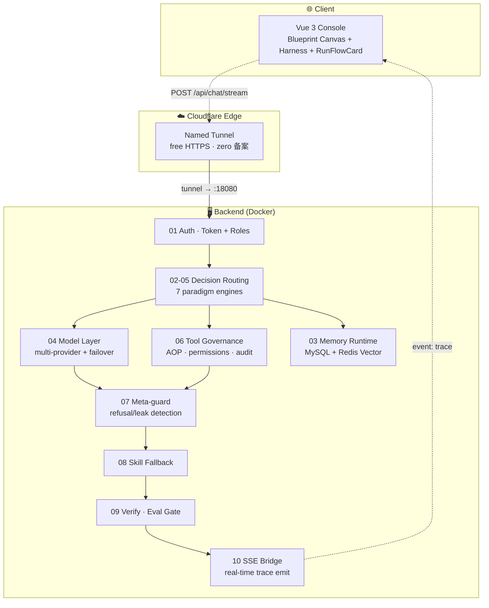

<div align="center">

# 🦾 SpringClaw

### The Agent Runtime Where Every Thought Is Visible

**7 paradigms. 10 harness shells. Zero black boxes.**

[](https://github.com/HhhBZzz/SpringClaw)
[](https://github.com/HhhBZzz/SpringClaw)
[](https://openjdk.org/)
[](https://spring.io/projects/spring-boot)
[](https://spring.io/projects/spring-ai)
[](https://vuejs.org/)
[](https://gsap.com/)
[](./LICENSE)
[]()

**[🚀 Live Demo](https://spring-claw.vercel.app)** · **[📖 API Docs](./http/springclaw-api.http)** · **[🔧 Runbook](./RUN_REAL_ENVIRONMENT.md)** · **[📝 Changelog](./CHANGELOG.md)**

</div>

---

## Table of Contents

- [🔥 Why SpringClaw](#-why-springclaw)
- [✨ What Makes It Different](#-what-makes-it-different)
- [📊 vs Other Frameworks](#-vs-other-frameworks)
- [🚀 Quick Start](#-quick-start)
- [💡 Examples](#-examples)
- [🏛️ Architecture](#️-architecture)
- [📋 Feature Matrix](#-feature-matrix)
- [🧩 Skill System](#-skill-system)
- [🔧 API Reference](#-api-reference)
- [🛠️ Tech Stack](#️-tech-stack)
- [📊 By the Numbers](#-by-the-numbers)
- [🗺️ Roadmap](#️-roadmap)
- [🔮 Future Blueprint](#-future-blueprint)
- [🤝 Contributing](#-contributing)
- [❓ FAQ](#-faq)
- [📄 License](#-license)

---

## 🔥 Why SpringClaw

Every agent framework says "powerful." Almost none let you **see** what's happening inside.

> [!TIP]
> Open the **[Live Demo](https://spring-claw.vercel.app)**, pick a paradigm, hit play, and watch the light-shuttle race through the agent's execution path in real time.

SpringClaw is an agent runtime built to be **read — not just run**:

- Watch a **ReAct** loop think: Thought → Action → Observation, looping back like an衔尾蛇.
- See a **Plan-Execute** tree branch, fail, and **replan** — the replan edge lights up red.
- Flip any node to **X-Ray** and read the actual Java line that fired (`ReActEngine.java:294`).
- Switch from ReAct to Multi-Agent and watch the topology morph from a loop to a hub-and-spoke — with GSAP Flip animation.
- All driven by **real execution trace** (`AgentTraceEvent` over SSE), not hardcoded demos.

This isn't a chat wrapper or a notebook demo. It's a **production-grade agent platform** with 10 harness shells — from auth to routing to model failover to tool governance to memory recall to meta-guard — every layer observable, switchable, and deployable.

### When to Use SpringClaw

| You want to... | SpringClaw helps because... |
|---|---|
| **Understand how agents work internally** | Every step is visualized — the full pipeline is a readable, annotated diagram, not a black box |
| **Compare agent paradigms** | 7 paradigms on one engine; switch with one click and watch the topology morph |
| **Build a governed agent for real use** | Tool AOP governance, risk classification, confirmation proposals, audit logs — enterprise-grade safety |
| **Self-host without vendor lock-in** | Docker + any LLM provider (DeepSeek/Qwen/Claude); zero cloud dependency |
| **Teach others about agents** | The Blueprint Canvas + Harness Conveyor are literally teaching tools — visual, interactive, annotated |
| **Deploy to production cheaply** | 2C2G VPS + Cloudflare Tunnel (zero 备案) + Vercel free tier = ~$5/month total |

---

## ✨ What Makes It Different

### 🔄 7 Agent Paradigms, Switchable at Runtime

The same engine, 7 architectures — pick the right one per task:

| Paradigm | Topology | Best For |
|----------|----------|----------|
| **ReAct** | Thought → Action → Observation loop | General reasoning with tools |
| **Plan-Execute** | Linear plan → execute → replan branch | Multi-step with dependencies |
| **OPAR** | Observe → Plan → Act → Reflect cycle | Deep analysis with self-correction |
| **Multi-Agent** | Coordinator → parallel workers → aggregate | Parallel subtasks (CompletableFuture) |
| **Reflexion** | Attempt → Reflect → Improve retry | Verbal reinforcement learning |
| **Autonomous Loop** | Goal → self-directed steps → verify | Write/side-effect tasks with guardrails |
| **Single-Turn** | Question → tool → answer | Simple function-calling |

Switch paradigms with one click — the **Blueprint Canvas** morphs the topology with GSAP Flip animation (nodes slide from a loop shape to a tree shape, fluidly).

### 🎨 Blueprint Canvas — See the Agent Think

A **2D node-graph visualization** where every execution step becomes a glowing node, connected by SVG curves, with a yellow light-shuttle racing along the path as the agent runs:

```
    ◉ Thought #1 ──light-shuttle──→ ◉ Action
    │                                 │
    └──── loop back ───────── ◉ Observation
                                 │
                                 ▼
                              ◉ Thought #2 ──→ ◉ Final Answer
```

- **Execution Pulse** — GSAP MotionPath light-shuttle flows along edges → hits nodes with neon glow + CSS glitch
- **X-Ray Mode** — click any node → 3D flip (`rotateY`) reveals the terminal: actual Java class, line number, code snippet
- **Paradigm Flip** — switch architectures → nodes morph from loop (ReAct) to tree (Plan-Execute) with GSAP Flip
- **Assembly Mode** — drag nodes with magnetic snap (`back.out` spring physics) to rearrange the topology
- **Combo Badge** — retry loops show `×3` counters that pop with `back.out(1.7)` and dissipate on breakthrough
- **Overflow to X-Ray** — when real trace events exceed the topology, extras flow into the node's terminal log (macro clean, details on the flip side)

> [!NOTE]
> The Blueprint Canvas runs at `/#/agent` → toggle to **[⚗ 动态沙盘]**. Try clicking nodes to X-Ray them!

### 🏗️ Harness Conveyor — The Full Product, Unpacked

The agent doesn't run alone. **10 layers of harness shells** wrap every run — and you can see all of them:

```
01 Transport · Auth     →  06 Tool Governance (AOP)
02 Route · Decide       →  07 Meta-guard (refusal/leak retry)
03 Context · Memory     →  08 Local Skill Fallback
04 Model · Failover     →  09 Verify · Eval Gate
05 Paradigm Core        →  10 Project · SSE Bridge
```

A light-shuttle flows through all 10 stations. Click any station → X-Ray its real trace log. All driven by live SSE trace events — not a static diagram.

### 📊 RunFlowCard — Inline Dynamic Flow

Every agent reply includes an **inline execution-flow card** built from that run's real `AgentTraceEvent[]`. Different task → different trace → different nodes. **No hardcoded demo modules** — the flow changes per question.

---

## 📊 vs Other Frameworks

| Feature | SpringClaw | LangChain | CrewAI | AutoGen |
|---------|-----------|-----------|--------|---------|
| **Language** | Java (Spring Boot) | Python | Python | Python / C# |
| **Paradigm switching** | ✅ 7 paradigms, runtime | ❌ single paradigm | ❌ Crew-only | ❌ conversation-only |
| **Full execution visualization** | ✅ Blueprint Canvas + Harness | ❌ logs only | ❌ logs only | ❌ logs only |
| **Node X-Ray (see the code)** | ✅ click node → Java line | ❌ | ❌ | ❌ |
| **Tool governance (AOP)** | ✅ permission + risk + audit | ⚠️ basic | ⚠️ basic | ⚠️ basic |
| **Memory system** | ✅ dual-track (MySQL + Redis Vector) | ✅ | ⚠️ basic | ⚠️ basic |
| **Meta-guard (refusal detection)** | ✅ | ❌ | ❌ | ❌ |
| **Channel adapters** | ✅ REST + Feishu + extensible | ❌ | ❌ | ❌ |
| **Self-hostable** | ✅ Docker, any VPS | ⚠️ depends | ⚠️ depends | ⚠️ depends |
| **Learn from it** | ✅ designed as teaching tool | ⚠️ documentation | ⚠️ documentation | ⚠️ documentation |

> [!IMPORTANT]
> SpringClaw isn't competing with LangChain/CrewAI on "who has more integrations." It competes on **transparency, observability, and learnability** — making the agent pipeline visible and comparable, which no other framework does.

---

## 🚀 Quick Start

### 30-Second Local Run

```bash
# Clone
git clone https://github.com/HhhBZzz/SpringClaw.git && cd SpringClaw

# Run (no real LLM key needed — falls back to local skills)
OPENCLAW_PRIMARY_API_KEY=test-key mvn spring-boot:run

# Verify
curl http://127.0.0.1:18080/actuator/health
# → {"status":"UP"}
```

### Docker Compose (Full Stack: MySQL + Redis + RabbitMQ + App)

```bash
OPENCLAW_PRIMARY_API_KEY=your-key docker compose up -d --build
```

Tuned for 2C2G servers out of the box: JVM `-Xmx512m`, MySQL `innodb-buffer-pool=128M`, Redis `maxmemory 96mb`.

### Frontend Console

```bash
cd frontend && npm install && npm run dev
# → http://localhost:5173/#/agent
```

### Deploy to Production

| Component | Where | Cost |
|-----------|-------|------|
| Frontend | **Vercel** (free CDN + HTTPS) | $0 |
| Backend | **Any VPS** (Docker, 2C2G OK) | ~$5/mo |
| Tunnel | **Cloudflare** (named tunnel, zero 备案) | $0 |
| Model | **DeepSeek** / Qwen / Claude | pay-per-use |

```bash
# Backend: one-click deploy script (included)
sudo REPO_URL=https://github.com/HhhBZzz/SpringClaw.git bash deploy-ali.sh

# Frontend: import repo to Vercel → Root Directory=frontend → 
# VITE_API_BASE=https://api.yourdomain.com → Deploy
```

---

## 💡 Examples

### Chat (SSE Streaming)

```bash
curl -N -X POST http://127.0.0.1:18080/api/chat/stream \
  -H 'Content-Type: application/json' \
  -d '{
    "sessionKey": "demo",
    "userId": "u1",
    "message": "Search the codebase for ReAct engine implementations",
    "paradigm": "REACT",
    "channel": "api"
  }'
```

The response streams back SSE events — each trace event carries the agent's real execution step:

```
event: trace
data: {"stepName":"Thought #1","type":"thought","detail":"用户要查 ReAct 引擎...","stepSchema":"ReActEngine.java:294"}

event: trace
data: {"stepName":"Action · search","type":"tool","detail":"命中 6 个实现","stepSchema":"ToolRuntimeAspect.java:130"}

event: trace
data: {"stepName":"最终答案","type":"final","detail":"Controller → ChatServiceImpl → EngineSelector → 7 引擎"}

event: done
```

These same trace events drive the **Blueprint Canvas** light-shuttle and the **RunFlowCard** in real time.

### Switch Paradigm

```bash
# Same question, different paradigm
curl -X POST http://127.0.0.1:18080/api/chat/send \
  -H 'Content-Type: application/json' \
  -d '{
    "sessionKey": "demo-2",
    "userId": "u1",
    "message": "Analyze the project architecture",
    "paradigm": "PLAN_EXECUTE",
    "channel": "api"
  }'
```

The engine switches from ReAct's Thought-Action-Observation loop to Plan-Execute's plan-all-then-execute strategy. In the Blueprint Canvas, the topology morphs from a **loop** to a **linear tree with a replan branch**.

### Register & Login

```bash
# Register
curl -X POST http://127.0.0.1:18080/api/auth/register \
  -H 'Content-Type: application/json' \
  -d '{"username":"admin","password":"your-password"}'

# Login (returns token + sets HttpOnly cookie)
curl -X POST http://127.0.0.1:18080/api/auth/login \
  -H 'Content-Type: application/json' \
  -d '{"username":"admin","password":"your-password"}'
```

---

## 🏛️ Architecture


```mermaid
flowchart TB
    subgraph Client["🌐 Client"]
        UI["Vue 3 Console\nBlueprint Canvas + Harness + RunFlowCard"]
    end

    subgraph Edge["☁️ Cloudflare Edge"]
        CF["Named Tunnel\nfree HTTPS · zero 备案"]
    end

    subgraph Server["🖥️ Backend (Docker)"]
        AUTH["01 Auth · Token + Roles"]
        ROUTE["02-05 Decision Routing\n7 paradigm engines"]
        MODEL["04 Model Layer\nmulti-provider + failover"]
        TOOLS["06 Tool Governance\nAOP · permissions · audit"]
        MEMORY["03 Memory Runtime\nMySQL + Redis Vector"]
        GUARD["07 Meta-guard\nrefusal/leak detection"]
        SKILL["08 Skill Fallback"]
        VERIFY["09 Verify · Eval Gate"]
        SSE["10 SSE Bridge\nreal-time trace emit"]

        AUTH --> ROUTE --> MODEL --> GUARD
        ROUTE --> TOOLS --> GUARD
        ROUTE --> MEMORY
        GUARD --> SKILL
        SKILL --> VERIFY --> SSE
    end

    UI -.->|"POST /api/chat/stream"| CF
    CF -->|"tunnel → :18080"| AUTH
    SSE -.->|"event: trace"| UI
```

### Request Lifecycle (One Run)

1. **Transport/Auth** — token validation, role check
2. **Route/Decide** — intent routing → paradigm/engine selection (7 engines)
3. **Context/Memory** — assemble prompt: MySQL event history + Redis vector recall
4. **Model/Failover** — call LLM provider with automatic failover (DeepSeek → Qwen → fallback)
5. **Paradigm Core** — the engine runs (ReAct loop / Plan-Execute tree / Multi-Agent fan-out / ...)
6. **Tool Governance** — every `@Tool` call passes AOP: permission → risk → rate limit → audit
7. **Meta-guard** — detect identity/refusal leaks → auto-retry if needed
8. **Skill Fallback** — if model unavailable, execute local skills gracefully
9. **Verify/Eval** — memory effectiveness gate, evaluation redline
10. **SSE Bridge** — emit trace events → frontend lights up the Blueprint Canvas

---

## 📋 Feature Matrix

| Area | Details |
|------|---------|
| **7 Paradigm Engines** | ReAct · Plan-Execute · OPAR · Multi-Agent · Reflexion · Autonomous · Single-Turn |
| **Blueprint Canvas** | Node graph + MotionPath shuttle + X-Ray flip + GSAP Flip paradigm switch + Draggable assembly + Combo badge |
| **Harness Conveyor** | 10-layer shell visualization + per-station X-Ray + live trace-driven |
| **RunFlowCard** | Inline dynamic flow per reply (real trace → nodes, non-hardcoded) |
| **Model Orchestration** | Multi-provider (DeepSeek/Qwen/Claude) · runtime switching · health-aware failover · token usage |
| **Dual-Track Memory** | MySQL event stream (authority) + Redis Vector Store (semantic recall) + context assembly |
| **Tool Governance** | `@Tool` AOP guard · permissions · risk levels (read/write/side-effect) · rate limits · confirmation proposals · audit logs |
| **Skill Platform** | `SKILL.md` catalog · Python/builtin/prompt skills · guarded script execution · usage sidecar |
| **Channel Adapters** | REST API · Feishu/Lark webhook + long connection · Telegram/WeChat extensible |
| **Security** | Token auth · HttpOnly cookies · role-based access · tool permission policies |
| **Frontend** | Vue 3 · Vite 8 · TypeScript · Pinia · GSAP 3.15 (Flip + MotionPath + Draggable) |
| **Deployment** | Docker Compose · `deploy-ali.sh` one-click · Cloudflare Tunnel · Vercel · 2C2G tuned |

---

## 🧩 Skill System

Skills are directory-based packages discovered from `SKILL.md` files under `skills/`. Three types:

### Python Skill (controlled local execution)

```markdown
# SKILL.md
---
name: codebase-search
type: python
entry: search.py
risk: read
---
Search the workspace using ripgrep and return ranked results.
```

### Builtin Skill (Java runtime)

```markdown
# SKILL.md
---
name: memory-recall
type: builtin
risk: read
---
Recall relevant memories from the Redis Vector Store.
```

### Prompt Skill (structured instruction)

```markdown
# SKILL.md
---
name: code-review-prompt
type: prompt
risk: read
---
You are a senior code reviewer. Analyze the following code for...
```

All skills are governed by the tool governance AOP (permission check → risk classification → rate limit → audit). Script execution is opt-in and guarded by allowlists.

See [docs/SCRIPT_SKILL_GUIDE.md](./docs/SCRIPT_SKILL_GUIDE.md) for the full package format.

---

## 🔧 API Reference

| Endpoint | Method | Auth | Description |
|----------|--------|------|-------------|
| `/api/chat/send` | POST | optional | Blocking chat completion |
| `/api/chat/stream` | POST | optional | SSE streaming chat with real-time trace |
| `/api/chat/async` | POST | required | Submit async chat job (RabbitMQ) |
| `/api/chat/async/{id}` | GET | required | Poll async result (Redis TTL) |
| `/api/chat/history` | GET | required | Chat history (MySQL) |
| `/api/chat/model-status` | GET | optional | Provider health + active model |
| `/api/chat/runs/{id}/trace` | GET | required | Full trace events for a run |
| `/api/auth/register` | POST | open | Register account |
| `/api/auth/login` | POST | open | Login → token + HttpOnly cookie |
| `/api/auth/me` | GET | required | Current user profile |
| `/api/tool-proposals` | GET | required | Pending tool confirmation proposals |
| `/api/tool-proposals/{id}/confirm` | POST | required | Confirm a tool action |
| `/api/runtime-console/overview` | GET | admin | Runtime dashboard data |
| `/api/webhook/feishu` | POST | webhook | Feishu webhook ingress |

Full examples: [http/springclaw-api.http](./http/springclaw-api.http)

---

## 🛠️ Tech Stack

| Layer | Technology |
|-------|------------|
| **Backend** | Java 17 · Spring Boot 3.5 · Spring AI 1.1 · Spring AOP · MyBatis-Plus |
| **AI** | Spring AI · OpenAI-compatible · Redis Vector Store · DeepSeek / Qwen / Claude |
| **Infra** | MySQL 8 · Redis Stack (RediSearch) · RabbitMQ · Redisson · XXL-JOB |
| **Frontend** | Vue 3 · Vite 8 · TypeScript · Pinia · Vue Router · GSAP 3.15 |
| **Deploy** | Docker · Docker Compose · Cloudflare Tunnel · Vercel · `deploy-ali.sh` |

---

## 📊 By the Numbers

| Metric | Value |
|--------|-------|
| Backend code (prod) | 55,500 lines Java |
| Backend tests | 1,090 tests · 41,300 lines · 0 failures |
| Frontend code | 22,000 lines (Vue + TS + CSS) |
| Frontend tests | 55 tests · 0 failures |
| Agent paradigms | 7 |
| Harness shells | 10 |
| **Total** | **~119,000 lines** |

---

## 🗺️ Roadmap

### ✅ Done

- [x] 7 paradigm engines (ReAct · Plan-Execute · OPAR · Multi-Agent · Reflexion · Autonomous · Single-Turn)
- [x] Blueprint Canvas (node graph + light-shuttle + X-Ray + Flip + Draggable + Combo Badge)
- [x] Harness Conveyor (10-layer product shell visualization + per-station X-Ray)
- [x] RunFlowCard (inline dynamic execution flow per reply)
- [x] Production deployment (Vercel + Cloudflare Tunnel + DeepSeek)

---

## 🔮 Future Blueprint

> **The goal: SpringClaw becomes the definitive reference platform for understanding, comparing, and deploying agent architectures.**

### Phase 1 — Framework-Level Switching

The same 7 paradigms, runnable on **different agent frameworks**. Switch the engine underneath without changing the visualization:

- Spring AI (current) ↔ LangGraph4j ↔ custom engines
- The Blueprint Canvas stays identical — only the implementation behind each node changes

### Phase 2 — Paradigm × Framework Matrix

A **matrix** where each cell is a runnable, observable combination:

```
              Spring AI    LangGraph4j    Akka
ReAct            ✅            ⬜          ⬜
Plan-Execute     ✅            ⬜          ⬜
Multi-Agent      ✅            ⬜          ⬜
```

Click any cell → Blueprint Canvas renders that combo → run a task → compare.

### Phase 3 — Real-Time A/B Paradigm Comparison

Run the **same task on two paradigms simultaneously** — watch both light-shuttles race, compare token usage, latency, quality **side by side**.

### Phase 4 — Interactive Learning Mode

Every run becomes an **annotated lesson**: each node carries a teaching annotation explaining what happened and why. A "guided walkthrough" traces one run end-to-end with inline commentary — like a debugger for agent cognition.

### Phase 5 — Agent Architecture Marketplace

Community-contributed paradigm blueprints, skill packages, governance policies. Import, fork, study.

### Phase 6 — Visualization Protocol Standard

The `CanvasNode / CanvasEdge / CanvasRunFrame` contract becomes an **open protocol**. Any framework (LangGraph, CrewAI, AutoGen) emits it → gets instant Blueprint Canvas visualization.

```
Today:  A self-hosted agent runtime you can observe and learn from
Tomorrow: The reference platform where the world studies agent architectures
```

---

## 🤝 Contributing

Contributions welcome! See [CONTRIBUTING.md](./CONTRIBUTING.md).

- Fork → Branch → PR
- Keep pull requests focused
- Security reports → [SECURITY.md](./SECURITY.md)
- Questions → [GitHub Discussions](https://github.com/HhhBZzz/SpringClaw/discussions)

---

## ❓ FAQ

**Q: Do I need a real LLM API key to try it?**

No. `OPENCLAW_PRIMARY_API_KEY=test-key` runs with local skill fallback. You'll see the full pipeline (routing, tools, memory, trace) — just without real LLM responses.

**Q: Can I use DeepSeek / Qwen / other models?**

Yes. SpringClaw supports any OpenAI-compatible provider. Set the provider's API key + base URL in `.env` and switch `SPRINGCLAW_AI_ACTIVE_PROVIDER`.

**Q: How much does it cost to deploy?**

~$5/month for a 2C2G VPS. Frontend is free on Vercel. Cloudflare Tunnel is free. The only variable cost is the LLM API (DeepSeek is ~$0.14/M tokens).

**Q: Why Java/Spring instead of Python?**

Enterprise-grade governance (AOP, transaction management, type safety), battle-tested infrastructure (Spring Boot ecosystem), and the JVM's observability tooling. Plus, Java makes the architecture more readable — you can see every layer.

**Q: Can I contribute a new paradigm engine?**

Yes! Implement `AgentEngine` with `paradigm()`, register it in `EngineSelector`, add a topology blueprint. See [the paradigm switching spec](./docs/superpowers/specs/2026-07-21-agent-paradigm-switching-foundation-design.md).

**Q: Does it work behind a firewall / without a domain?**

Yes. Cloudflare Tunnel only needs outbound access. Or use it fully on localhost — the frontend dev server proxies to the backend automatically.

---

## 📄 License

[MIT License](./LICENSE) — build, deploy, learn, extend.

---

<div align="center">

**⭐ If SpringClaw helped you understand agents, give it a star.**

Made with ☕ · 🦎 · ⚡ by **EdwinHan**

</div>
