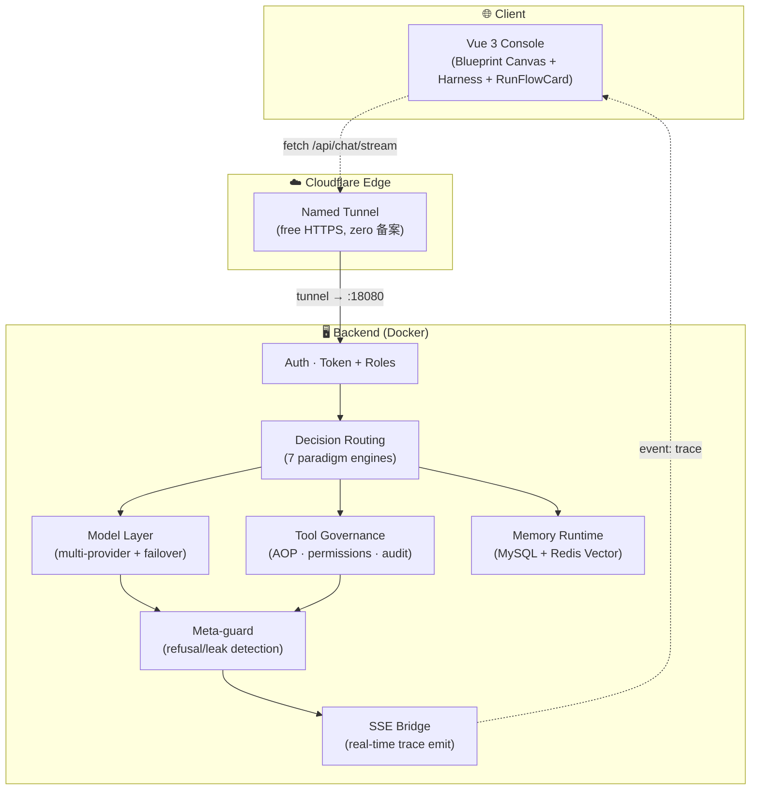

<div align="center">

# 🦾 SpringClaw

### The Agent Runtime Where Every Thought Is Visible

**7 paradigms. 10 harness shells. Zero black boxes.**

[](https://github.com/HhhBZzz/SpringClaw)
[](https://github.com/HhhBZzz/SpringClaw)
[](https://openjdk.org/)
[](https://spring.io/projects/spring-boot)
[](https://spring.io/projects/spring-ai)
[](https://vuejs.org/)
[](https://gsap.com/)
[](./LICENSE)
[]()

**[Live Demo](https://spring-claw.vercel.app)** · **[API Docs](./http/springclaw-api.http)** · **[Runbook](./RUN_REAL_ENVIRONMENT.md)** · **[Changelog](./CHANGELOG.md)**

</div>

---

## 🔥 Why SpringClaw Exists

Every agent framework says "powerful." Almost none let you **see** what's happening inside. SpringClaw is different:

> **It's an agent runtime built to be read — not just run.**

Watch a ReAct loop think. See a Plan-Execute tree branch. Flip a node to X-Ray and read the actual Java line that fired. Switch from ReAct to Multi-Agent and watch the topology morph in real time. All driven by real execution trace, not hardcoded demos.

This isn't a chat wrapper. It's a **production-grade agent platform** where the full pipeline — from auth to routing to model failover to tool governance to memory recall to meta-guard — is observable, switchable, and deployable.

---

## ✨ What Makes It Different

### 🔄 7 Agent Paradigms, Switchable at Runtime

The same engine, 7 architectures — pick the right one per task:

| Paradigm | Shape | Best For |
|----------|-------|----------|
| **ReAct** | Thought → Action → Observation loop | General reasoning with tools |
| **Plan-Execute** | Plan all → Execute → Replan on failure | Multi-step with dependencies |
| **OPAR** | Observe → Plan → Act → Reflect | Deep analysis with self-correction |
| **Multi-Agent** | Coordinator → parallel workers → aggregate | Parallel subtasks |
| **Reflexion** | Attempt → Reflect → Improve retry | Verbal reinforcement learning |
| **Autonomous Loop** | Goal → self-directed steps → verify | Write/side-effect tasks |
| **Single-Turn** | Question → tool → answer | Simple function-calling |

Switch paradigms with one click — the **Blueprint Canvas** morphs the topology with GSAP Flip animation.

### 🎨 Blueprint Canvas — See the Agent Think

A **2D node-graph visualization** where every execution step becomes a glowing node, connected by SVG curves, with a yellow light-shuttle racing along the path as the agent runs:

- **Execution Pulse** — GSAP MotionPath light-shuttle flows along edges, hitting nodes with neon glow + CSS glitch.
- **X-Ray Mode** — click any node → 3D flip (`rotateY`) reveals the terminal log: actual Java class, line number, execution detail.
- **Paradigm Flip** — switching architectures morphs nodes from a loop (ReAct) to a tree (Plan-Execute) with GSAP Flip fluid animation.
- **Assembly Mode** — drag nodes with magnetic snap (`back.out` spring physics) to rearrange the topology.
- **Combo Badge** — retry loops show `×3` counters that pop with `back.out` and dissipate on breakthrough.
- **Overflow to X-Ray** — when real trace events exceed the topology frame count, extras don't truncate — they flow into the active node's terminal log (macro stays clean, details on the flip side).

### 🏗️ Harness Conveyor — The Full Product, Unpacked

The agent doesn't run alone. **10 layers of harness shells** wrap every run — and you can see all of them:

```
01 Transport · Auth     →  06 Tool Governance (AOP)
02 Route · Decide       →  07 Meta-guard (refusal/leak retry)
03 Context · Memory     →  08 Local Skill Fallback
04 Model · Failover     →  09 Verify · Eval Gate
05 Paradigm Core        →  10 Project · SSE Bridge
```

A light-shuttle flows through all 10 stations. Click any to X-Ray its real trace log. All driven by live SSE trace events — not a static diagram.

### 📊 RunFlowCard — Inline Dynamic Flow

Every agent reply includes an **inline execution-flow card** built from that run's real `AgentTraceEvent[]`. Different task → different trace → different nodes. No hardcoded demo modules — the flow changes per question.

---

## 🚀 Quick Start

### One-Command Local Run

```bash
OPENCLAW_PRIMARY_API_KEY=test-key mvn spring-boot:run
```

No real LLM key needed — falls back to local skills. Health check:

```bash
curl http://127.0.0.1:18080/actuator/health
# → {"status":"UP"}
```

### Docker Compose (Full Stack)

```bash
OPENCLAW_PRIMARY_API_KEY=your-key docker compose up -d --build
```

Brings up MySQL 8 + Redis Stack + RabbitMQ + the app. Tuned for 2C2G servers out of the box (`-Xmx512m`, `mem_limit` per container).

### Frontend Console

```bash
cd frontend && npm install && npm run dev
# → http://localhost:5173/#/agent
```

### Deploy to Production (Vercel + Cloudflare Tunnel)

| Component | Where | Cost |
|-----------|-------|------|
| Frontend | **Vercel** (free CDN + HTTPS) | $0 |
| Backend | **Any VPS** (Docker) | ~$5/mo |
| Tunnel | **Cloudflare** (named tunnel, zero 备案) | $0 |
| Model | **DeepSeek** / any OpenAI-compatible | pay-per-use |

```bash
# Backend: deploy script included
sudo REPO_URL=https://github.com/YOUR/springclaw.git bash deploy-ali.sh

# Frontend: import to Vercel → set Root Directory=frontend → VITE_API_BASE=https://api.yourdomain.com → Deploy
```

---

## 🏛️ Architecture


```mermaid
flowchart TB
    subgraph Client["🌐 Client"]
        UI["Vue 3 Console\n(Blueprint Canvas + Harness + RunFlowCard)"]
    end

    subgraph Edge["☁️ Cloudflare Edge"]
        CF["Named Tunnel\n(free HTTPS, zero 备案)"]
    end

    subgraph Server["🖥️ Backend (Docker)"]
        AUTH["Auth · Token + Roles"]
        ROUTE["Decision Routing\n(7 paradigm engines)"]
        MODEL["Model Layer\n(multi-provider + failover)"]
        TOOLS["Tool Governance\n(AOP · permissions · audit)"]
        MEMORY["Memory Runtime\n(MySQL + Redis Vector)"]
        GUARD["Meta-guard\n(refusal/leak detection)"]
        SSE["SSE Bridge\n(real-time trace emit)"]

        AUTH --> ROUTE
        ROUTE --> MODEL
        ROUTE --> TOOLS
        ROUTE --> MEMORY
        MODEL --> GUARD
        TOOLS --> GUARD
        GUARD --> SSE
    end

    UI -.->|"fetch /api/chat/stream"| CF
    CF -->|"tunnel → :18080"| AUTH
    SSE -.->|"event: trace"| UI
```

---

## 📋 Feature Matrix

| Area | Details |
|------|---------|
| **7 Paradigm Engines** | ReAct · Plan-Execute · OPAR · Multi-Agent · Reflexion · Autonomous · Single-Turn |
| **Blueprint Canvas** | Node graph + MotionPath shuttle + X-Ray flip + GSAP Flip paradigm switch + Draggable assembly |
| **Harness Conveyor** | 10-layer shell visualization + per-station X-Ray + live trace-driven |
| **RunFlowCard** | Inline dynamic flow per reply (real trace → nodes) |
| **Model Orchestration** | Multi-provider (DeepSeek/Qwen/Claude) · runtime switching · health-aware failover · token usage |
| **Memory** | MySQL event stream (authority) + Redis Vector Store (semantic recall) + context assembly |
| **Tool Governance** | `@Tool` AOP guard · permissions · risk levels · rate limits · confirmation proposals · audit logs |
| **Skill Platform** | `SKILL.md` catalog · Python/builtin/prompt skills · guarded script execution |
| **Channels** | REST API · Feishu/Lark webhook + long connection · adapter interface |
| **Security** | Token auth · HttpOnly cookies · role-based access · tool permission policies |
| **Frontend** | Vue 3 · Vite · TypeScript · Pinia · GSAP (Flip + MotionPath + Draggable) |
| **Deployment** | Docker Compose · deploy-ali.sh one-click · Cloudflare Tunnel · Vercel |

---

## 🛠️ Tech Stack

| Layer | Tech |
|-------|------|
| **Backend** | Java 17 · Spring Boot 3.5 · Spring AI 1.1 · Spring AOP · MyBatis-Plus |
| **AI** | Spring AI · OpenAI-compatible providers · Redis Vector Store · DeepSeek |
| **Infra** | MySQL 8 · Redis Stack (RediSearch) · RabbitMQ · Redisson · XXL-JOB |
| **Frontend** | Vue 3 · Vite 8 · TypeScript · Pinia · Vue Router · GSAP 3.15 |
| **Deploy** | Docker · Docker Compose · Cloudflare Tunnel · Vercel · deploy-ali.sh |

---

## 📊 By the Numbers

| Metric | Value |
|--------|-------|
| Backend code (prod) | 55,500 lines Java |
| Backend tests | 1,090 tests · 41,300 lines · 0 failures |
| Frontend code | 22,000 lines (Vue + TS + CSS) |
| Frontend tests | 55 tests · 0 failures |
| Agent paradigms | 7 |
| Harness shells | 10 |
| Total | **~119,000 lines** |

---

## 🔧 Configuration

Key environment variables (full list in `application.yml`):

| Variable | Purpose |
|----------|---------|
| `SPRINGCLAW_PRIMARY_API_KEY` | Primary model (Claude/compatible) |
| `SPRINGCLAW_DEEPSEEK_API_KEY` | DeepSeek provider |
| `SPRINGCLAW_QWEN_API_KEY` | Qwen/DashScope provider |
| `SPRINGCLAW_AI_ACTIVE_PROVIDER` | Active provider: `primary` / `deepseek` / `qwen` |
| `SPRINGCLAW_CHAT_AGENT_MODE` | Engine mode: `simplified` / `opar` |
| `SPRINGCLAW_WEB_CORS_ALLOWED_ORIGINS` | CORS origins (exact, no wildcard with credentials) |

---

## 🗺️ Roadmap

- [x] 7 paradigm engines (ReAct → Multi-Agent)
- [x] Blueprint Canvas + Harness Conveyor + RunFlowCard
- [x] Production deployment (Vercel + Cloudflare Tunnel)
- [ ] Framework-level switching (Spring AI / LangGraph4j)
- [ ] Paradigm × framework matrix
- [ ] Playwright visual regression for CSS cleanup
- [ ] Annotated end-to-end pipeline walkthrough

---

## 🤝 Contributing

Contributions welcome! See [CONTRIBUTING.md](./CONTRIBUTING.md). Security reports → [SECURITY.md](./SECURITY.md).

## 📄 License

[MIT License](./LICENSE) — build, deploy, learn, extend.

---

<div align="center">

**⭐ If SpringClaw helped you understand agents, give it a star.**

Made with ☕ · 🦎 · ⚡ by **EdwinHan**

</div>
