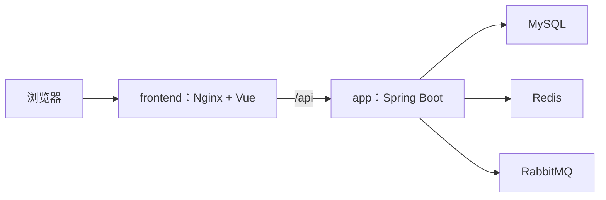

# SpringClaw

SpringClaw 是一个基于 Spring Boot 的 AI Agent 运行时，包含受治理的工具调用、可持久化的对话记录、Redis 记忆、多模型路由和 Vue 运维控制台。项目支持两种明确的运行方式：便于改代码的本地开发模式，以及可整体交付的 Docker Compose 模式。

[English README](./README.md) · [运行与运维手册](./RUN_REAL_ENVIRONMENT.md) · [变更日志](./CHANGELOG.md) · [Skill 指南](./docs/SCRIPT_SKILL_GUIDE.md)

## 交付时会启动什么



正式交付文件只把前端 HTTP 端口映射到宿主机；后端、MySQL、Redis、RabbitMQ 都留在 Docker 内部网络。`docker-compose.dev.yml` 只用于开发，它把三项基础依赖映射到本机回环地址，供 Maven 和 Vite 连接。

## 环境要求

- Docker Desktop（包含 Docker Compose v2）
- 本地开发额外需要：JDK 17+、Maven 3.8+、Node.js 22+、npm

## 首次配置

从模板创建仅供本机使用的配置；`.env` 不应提交到 Git。

```bash
cp .env.example .env
```

替换模板里的所有基础设施密码占位值，并重点检查：

| 配置 | 含义 |
| --- | --- |
| `MYSQL_ROOT_PASSWORD`、`MYSQL_PASSWORD`、`REDIS_PASSWORD`、`RABBITMQ_PASSWORD` | 状态服务的必填密码，不能保留模板占位文本。 |
| `SPRINGCLAW_ADMIN_USERNAMES` | 逗号分隔的管理员用户名；这些用户名注册时会成为 `ADMIN`。正式环境应保持 `SPRINGCLAW_AUTH_BOOTSTRAP_FIRST_USER_ADMIN=false`。 |
| `SPRINGCLAW_PASSWORD_PEPPER` | 密码哈希可选附加密钥；一旦线上使用，不要在没有账号迁移方案时更换。 |
| `SPRINGCLAW_HTTP_BIND_ADDRESS`、`SPRINGCLAW_HTTP_PORT` | Nginx 前端的宿主机绑定。没有 TLS 反向代理时请保持默认回环地址。 |
| `SPRINGCLAW_AUTH_COOKIE_SECURE` | 本机 HTTP 调试才设为 `false`；HTTPS/TLS 入口必须设为 `true`。 |
| `SPRINGCLAW_AI_ACTIVE_PROVIDER` 及某个 provider 的 enabled/key/base-url/model | 所有模型都关闭时平台仍可健康启动；要实际聊天，必须明确启用并配置一个模型提供方。 |

Flyway 会在应用启动时自动校验并按顺序执行迁移；已有数据库只会继续升级，不会自动清空数据，破坏性 clean 操作已禁用。

## 本地开发：Maven + Vite

改后端或前端时使用此模式：Docker 只提供依赖，Maven 和 Vite 在宿主机运行，并读取同一份 `.env`。

```bash
make dev-infra
mvn spring-boot:run

# 另开一个终端
cd frontend
npm ci
npm run dev
```

浏览器打开 `http://127.0.0.1:5173`。Vite 会将 `/api` 请求代理给本机 `http://127.0.0.1:18080` 后端。

## 完整 Docker Compose 交付

需要验证“用户拿到后能完整运行”的版本时，使用这一组命令：

```bash
make up
make ps
make verify
```

`make verify` 会先校验 Compose 配置，再在最多 120 秒内等待五项服务健康；随后访问前端首页、确认 `/api/auth/me` 经过反向代理能返回任意 HTTP 响应（未登录是正常的），并在应用容器内部检查 Actuator 健康状态。它默认使用 Docker Compose 解析 `.env` 后得到的 `SPRINGCLAW_HTTP_PORT`；只有需要临时覆盖时才设置 `HTTP_PORT`。

常用命令：

```bash
make logs       # 持续查看所有服务最近 200 行日志
make down       # 停止容器，但保留命名卷和业务数据
```

服务器部署时，应让前端端口只绑定到回环地址，并由外部 TLS 反向代理对外提供 HTTPS。浏览器通过 HTTPS 访问时必须设置 `SPRINGCLAW_AUTH_COOKIE_SECURE=true`；安全 Cookie 在纯 HTTP 下不能正常工作。

日志、备份、恢复、升级和明确标注的破坏性清理流程见 [RUN_REAL_ENVIRONMENT.md](./RUN_REAL_ENVIRONMENT.md)。

## 主要 API

| 接口 | 方法 | 用途 |
| --- | --- | --- |
| `/api/chat/send` | `POST` | 同步聊天 |
| `/api/chat/stream` | `POST` | SSE 流式聊天 |
| `/api/chat/async` | `POST` | 提交异步聊天任务 |
| `/api/auth/register` | `POST` | 注册账号 |
| `/api/auth/login` | `POST` | 登录并创建会话 |
| `/api/auth/me` | `GET` | 获取当前身份 |
| `/api/webhook/feishu` | `POST` | 飞书 Webhook 入口 |

请求示例见 [http/springclaw-api.http](./http/springclaw-api.http)。

## 开发检查

```bash
mvn test
cd frontend && npm test && npm run build
docker compose --env-file .env config --quiet
make verify
```

## 目录结构

```text
springclaw/
├── src/main/java/com/springclaw/  # Spring Boot 应用
├── src/main/resources/            # Spring 配置和 Flyway 资源
├── frontend/                      # Vue 3 控制台和 Nginx 镜像资产
├── skills/                        # 目录化 Skill 包
├── docker-compose.yml             # 完整交付拓扑
├── docker-compose.dev.yml         # 本地开发依赖覆盖文件
├── Makefile                       # 支持的启动与运维命令
└── RUN_REAL_ENVIRONMENT.md        # 运行与运维手册
```

## 许可证

SpringClaw 使用 [MIT License](./LICENSE)。
