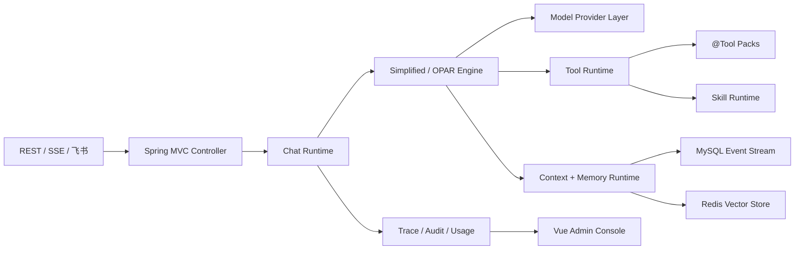

# SpringClaw

**面向 Spring Boot 的自部署可治理 AI Agent Runtime —— 可跑、可读、可学。**

SpringClaw 基于 Spring Boot 3.5 和 Spring AI 1.1 构建，是开发者和技术团队自部署的可治理 Java Agent 基座。它把多模型编排、记忆、工具治理、Skill 运行时、渠道接入和 Vue 管理后台放在同一个工程里，完整呈现"决策路由 → 工具治理 → 记忆闭环 → 反思"的 agent 流程，适合自部署、二次开发，也可作为学习生产级 agent 架构的参考实现。

[English README](./README.md) · [真实环境运行指南](./RUN_REAL_ENVIRONMENT.md) · [变更日志](./CHANGELOG.md) · [Script Skill 指南](./docs/SCRIPT_SKILL_GUIDE.md)

---

## 项目定位

SpringClaw 关注的是 Agent 产品真正难维护的部分：

- 模型不写死在业务代码里，支持 provider/model 切换、失败转移、流式输出、异步任务和用量统计。
- 记忆不是临时变量，短期对话事件落 MySQL，长期语义记忆走 Redis Vector Store。
- 工具不是裸奔调用，统一经过权限、限流、风险分级、动作确认和审计。
- Skill 不是继续堆 Java 分支，而是以 `SKILL.md` 目录包的方式注册、查看、执行和统计。
- 后台不是展示假数据，而是围绕模型、用户、角色、工具、Skill、记忆、缓存、审计、会话和 token 用量提供真实运维入口。

## 完整 agent 流程可观察

SpringClaw 把整个 agent 流程做成可见的，因此也适合作为学习生产级 agent 的参考实现：

- **决策路由**：规则 + 模型辅助路由，在 simplified 和 OPAR（观察-计划-行动-反思）引擎间选择，模型不可用时确定性降级。
- **工具治理**：每个 `@Tool` 调用都经过同一套 AOP 守卫——权限、限流、风险分级、确认 proposal、哈希校验执行、审计；写动作在带 HEAD 基线回滚的围栏工作区里执行。
- **记忆闭环**：真正的 Write-Manage-Read——MySQL 为权威，Redis 短期热窗，Redis VectorStore 为派生索引，外加终态语义抽取与反思，可在后台审核。
- **可观测性**：Vue 后台展示会话、工具确认单、记忆候选、知识源、评估红线、模型用量，能直观看到一次 run 如何走完整个流水线。

聊完一次后打开运行时控制台 `/#/agent`，即可查看上一次 run 的每个阶段。

## 核心能力

| 模块 | 能力 |
| --- | --- |
| Chat Runtime | 同步聊天、SSE 流式聊天、RabbitMQ 异步聊天 |
| Agent 模式 | 默认 simplified 快速链路，复杂任务可走 OPAR 循环 |
| 多模型 | 多 provider 配置、运行时切换、健康检查、失败转移、token 用量记录 |
| 记忆 | MySQL 会话事件流、Redis 向量记忆、上下文组装和语义召回 |
| 工具治理 | Spring AI `@Tool` 工具包、AOP 拦截、权限、限流、审计 |
| 动作安全 | 写入、副作用、危险操作生成确认 proposal |
| Skill 平台 | `SKILL.md` 目录化技能、Python/builtin/prompt 类型、受控脚本执行 |
| 渠道接入 | REST API、飞书 Webhook、飞书长连接、Telegram/微信适配接口 |
| 认证授权 | 登录、Token、HttpOnly Cookie、角色权限、ADMIN 后台 |
| 运维后台 | Vue 3 控制台，覆盖模型、Skill、记忆、缓存、审计、会话和用量 |

## 架构图



## 快速启动

### 环境要求

- JDK 17+
- Maven 3.8+
- Docker Desktop，可选但推荐

### 本地最简启动

```bash
OPENCLAW_PRIMARY_API_KEY=test-key mvn spring-boot:run
```

服务默认运行在 `http://127.0.0.1:18080`。没有真实模型 key 也可以启动，用于验证本地技能和降级链路。

```bash
curl http://127.0.0.1:18080/actuator/health

curl -X POST http://127.0.0.1:18080/api/chat/send \
  -H 'Content-Type: application/json' \
  -d '{
    "sessionKey": "demo-1",
    "userId": "u1",
    "message": "用一段话介绍 SpringClaw",
    "channel": "api"
  }'
```

### Docker Compose 启动

```bash
OPENCLAW_PRIMARY_API_KEY=test-key docker compose up -d --build
```

该模式会同时启动应用、MySQL 8、Redis Stack 和 RabbitMQ，适合验证持久化会话、向量记忆、分布式锁和异步聊天。

### 前端控制台

```bash
cd frontend
npm install
npm run dev
```

访问 `http://localhost:5173/#/agent`。Vite 会把 `/api/*` 代理到后端 `localhost:18080`。

## 常用配置

| 环境变量 | 说明 | 示例 |
| --- | --- | --- |
| `OPENCLAW_PRIMARY_API_KEY` | 主模型 API Key | `sk-...` |
| `OPENCLAW_CODING_PLAN_API_KEY` | Coding Plan 模型 Key | `sk-...` |
| `OPENCLAW_DEEPSEEK_API_KEY` | DeepSeek 模型 Key | `sk-...` |
| `OPENCLAW_EMBEDDING_API_KEY` | Embedding API Key | `sk-...` |
| `OPENCLAW_EMBEDDING_MODEL` | Embedding 模型 | `text-embedding-v4` |
| `OPENCLAW_CHAT_AGENT_MODE` | Agent 模式 | `simplified` / `opar` |
| `OPENCLAW_FEISHU_OUTBOUND_ENABLED` | 飞书主动回消息 | `true` / `false` |
| `OPENCLAW_FEISHU_LONG_CONNECTION_ENABLED` | 飞书长连接模式 | `true` / `false` |
| `SPRING_PROFILES_ACTIVE` | Spring Profile | `dev` / `prod` |

完整部署说明见 [RUN_REAL_ENVIRONMENT.md](./RUN_REAL_ENVIRONMENT.md)。

## 主要 API

| 接口 | 方法 | 说明 |
| --- | --- | --- |
| `/api/chat/send` | `POST` | 同步聊天 |
| `/api/chat/stream` | `POST` | SSE 流式聊天 |
| `/api/chat/async` | `POST` | 异步聊天 |
| `/api/auth/register` | `POST` | 用户注册 |
| `/api/auth/login` | `POST` | 用户登录 |
| `/api/auth/me` | `GET` | 当前用户信息 |
| `/api/webhook/feishu` | `POST` | 飞书 Webhook 入口 |
| `/admin` | `GET` | 管理后台入口 |

更多请求样例见 [http/springclaw-api.http](./http/springclaw-api.http)。

## 目录结构

```text
springclaw/
├── src/main/java/com/springclaw/
│   ├── controller/          # 聊天、认证、后台、runtime、webhook 接口
│   ├── service/
│   │   ├── chat/            # 聊天编排和 Agent 引擎
│   │   ├── ai/              # 模型 provider 管理和调用
│   │   ├── memory/          # 语义记忆、索引、学习、memory frame
│   │   ├── context/         # 上下文组装
│   │   ├── skill/           # Skill catalog、runtime、markdown/script 支持
│   │   ├── task/            # 定时任务和异步任务执行
│   │   └── usage/           # 模型用量统计
│   ├── runtime/             # canonical runtime 身份、生命周期、memory contract
│   ├── tool/                # 工具包和工具治理运行时
│   ├── strategy/channel/    # 多渠道适配器
│   ├── web/auth/            # 认证和角色拦截器
│   └── config/              # Spring / AI / Cache / MQ / Redis / MyBatis 配置
├── frontend/                # Vue 3 + Vite 运维控制台
├── skills/                  # 目录化 Skill 包
├── data/                    # 本地 runtime 数据占位
├── docs/                    # 架构说明、运行手册、Skill 文档
├── docker-compose.yml
├── Dockerfile
└── pom.xml
```

## 技术栈

| 层次 | 技术 |
| --- | --- |
| 后端 | Java 17, Spring Boot 3.5, Spring MVC, Spring AOP |
| AI | Spring AI 1.1, OpenAI-compatible providers, Redis Vector Store |
| 存储 | MySQL 8, MyBatis-Plus |
| 缓存与锁 | Redis Stack, Redisson |
| 消息队列 | RabbitMQ |
| 定时任务 | XXL-JOB |
| 渠道 SDK | Lark/Feishu OAPI |
| 前端 | Vue 3, Vite, TypeScript, Pinia, Vue Router, GSAP |
| 构建部署 | Maven, Docker, Docker Compose |

## Skill 体系

Skill 存放在 `skills/` 目录下，由 `SKILL.md` 描述。当前支持三类：

- **Python/script skill**：执行受控本地脚本。
- **Builtin skill**：由 Java runtime 实现。
- **Prompt skill**：作为结构化说明和提示词资产。

脚本执行默认受配置和白名单约束，避免把任意本地执行能力暴露给模型。格式与运行规则见 [docs/SCRIPT_SKILL_GUIDE.md](./docs/SCRIPT_SKILL_GUIDE.md)。

## 路线图

- 稳定 canonical run lifecycle 存储与 replay API。
- 强化运行 trace 页面，展示工具调用、记忆读写、模型降级和失败原因。
- 完善 Skill 导入、导出、权限审查和使用统计。
- 扩展更多渠道适配器和 outbound delivery 策略。
- 沉淀小团队内部 Agent 部署预设。

## 贡献

欢迎提交 issue 和 PR。非小改动请先开 issue 对齐方向，PR 保持小而清晰。贡献说明见 [CONTRIBUTING.md](./CONTRIBUTING.md)，安全问题请按 [SECURITY.md](./SECURITY.md) 处理。

## 许可证

SpringClaw 使用 [MIT License](./LICENSE)。
