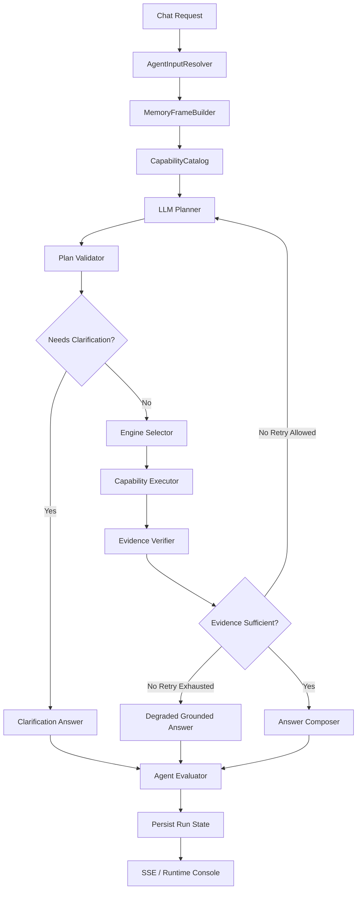

# SpringClaw Agent Product And Technical Strategy

> Date: 2026-06-06  
> Scope: SpringClaw personal local AI Agent runtime, Java backend, Vue frontend, local tools, skills, memory, evaluation, ops console.  
> Purpose: prevent future glue-code fixes by defining the product direction, runtime architecture, module boundaries, deletion targets, and acceptance rules for every future Agent change.

---

## 1. Executive Decision

SpringClaw is not a normal chatbot with several local utilities attached. It must be treated as a local Agent runtime for a Java engineer.

The product must support one core loop:

1. User asks or assigns a task.
2. Runtime understands the request with memory and current project context.
3. Runtime plans with a structured model output.
4. Runtime executes approved capabilities.
5. Runtime verifies evidence.
6. Runtime produces a consistent answer.
7. Runtime records trace, tool calls, memory updates, token cost, and quality scores from the same run state.

The architectural decision is:

> SpringClaw must move from scattered rule-driven service branches to a single model-planned, memory-aware, evidence-verified Agent state machine.

Capability keywords and deterministic rules are allowed only as hints and guardrails. They are not allowed to become the core business routing mechanism.

---

## 2. Product Positioning

### 2.1 Target User

The primary user is an experienced Java engineer running SpringClaw locally. The product does not need beginner guidance or marketing-style onboarding.

The user expects:

- Local project understanding.
- Real tool execution instead of decorative buttons.
- Skills discovered from the local environment.
- Clear run trace and tool-call history.
- Model switching and provider health.
- Token usage, cost, scheduled tasks, and background jobs.
- Reliable follow-up questions using memory.
- Consistent answer format.
- Evaluation based on measurable stages, not subjective feeling.

### 2.2 Product Promise

SpringClaw should feel like a local AI engineering command center.

It should answer:

- What did the Agent understand?
- What did it decide?
- Which capabilities did it select?
- Which tools actually ran?
- What evidence came back?
- Did reflection and verification pass?
- What did the answer cost?
- What memory was read or written?
- Why did a failure happen?

If the UI shows a tool executed, the final answer must come from the same run state. The frontend must never show one branch's trace while the answer comes from another fallback branch.

### 2.3 Product Surfaces

The visual style should remain close to the existing dark SpringClaw preview, but every visible button must map to real product behavior.

Required surfaces:

- Agent Console: primary chat and task execution view.
- Sessions: real session list, session search, session resume, archived sessions.
- Agents: configured runtime agents, execution modes, model/provider binding, enabled state.
- Skills: local installed skills, skill metadata, allowed tool packs, last run, import path, status.
- Tools: registered capabilities from backend descriptors, risk, operations, status, permissions.
- Memory: session memory, semantic recall, user memory, memory writes from recent runs.
- Logs: run logs, model failures, tool failures, fallback decisions.
- Run Trace: run state timeline from backend `AgentRunState`.
- Tool Calls: actual invocations with args, status, evidence, duration.
- Usage: token totals, provider/model split, cache hits, recent cost.
- Scheduled Tasks: local recurring/background tasks, next run, last status.
- Model Switcher: clickable provider/model control, health and active model state.
- Login/User Area: identity, role, admin/developer flags, permissions.

### 2.4 UI Contract

The frontend must render backend state. It must not invent runtime state.

For the right panel:

- `Run Trace` reads `agent_run` and `agent_run_step`.
- `Tool Calls` reads `tool_invocation`.
- `Memory` reads memory events and recalled memory from the same request id when available.
- `Logs` reads runtime log events for the same request id/session.

Tab widths, right-panel size, and layout state should be stable. Clicking tabs changes content, not panel geometry.

---

## 3. Current Failure Pattern

The current system repeatedly fails because responsibilities are split across many code paths:

- `ChatServiceImpl` chooses between basic streaming, model-led streaming, Agent runtime, OPAR, fallback, and persistence.
- `AgentDecisionRouter` performs deterministic business routing.
- `ChatRoutingPolicyService` performs a second routing decision.
- `LocalSkillFallbackService` contains capability-specific fallback logic.
- OPAR and simplified engines have their own local execution and narration logic.
- Trace persistence and SSE events are emitted from several places.
- Some paths are evaluated; other paths are not.

The result is a system where adding one capability can require edits in several unrelated files.

This creates the exact anti-pattern the project must eliminate:

> A new capability or user question is fixed by adding another keyword, resolver, switch case, or fallback branch.

---

## 4. Non-Negotiable Architecture Principles

### 4.1 One Request, One Run State

Every user request must create exactly one canonical `AgentRunState`.

All answer text, right-panel trace, tool calls, memory events, token usage, and quality score must be derived from that run state.

No component may generate a separate hidden branch and return it as the final answer without attaching it to the run state.

### 4.2 Model-Planned, Backend-Verified

The model may decide:

- user intent
- selected capabilities
- operation arguments
- missing slots
- whether the request needs a multi-step plan
- answer outline

The backend must verify:

- schema validity
- permissions
- safety and risk
- tool availability
- argument completeness
- evidence sufficiency
- answer grounding
- token and timeout budgets

The model drives the plan. The backend guards and scores execution.

### 4.3 Capability Descriptions Are Data, Not Routing Code

Adding a capability must not require edits to:

- `ChatServiceImpl`
- `AgentDecisionRouter`
- `ChatRoutingPolicyService`
- `LocalSkillFallbackService`
- `ToolOrchestrator`
- `AgentCapabilityExecutionService`

A capability is added by registering a descriptor and executor. Routing uses the catalog and planner.

### 4.4 Rules Are Guardrails Only

Deterministic rules are allowed for:

- dangerous actions
- permission checks
- confirmation requirements
- provider health and circuit breaking
- token budgets
- timeout budgets
- schema validation
- filesystem boundary checks
- network access policy
- tool availability

Deterministic rules are not allowed as primary business intent detection.

Examples of disallowed future patterns:

```java
if (question.contains("股票")) {
    return new AgentDecision("stock", ...);
}
```

```java
switch (intent) {
    case "weather" -> weatherTool.query(...);
    case "stock" -> stockTool.query(...);
}
```

```java
if (answer.contains("<TRUNCATED>")) {
    return "请用户自己打开网页";
}
```

### 4.5 Deletion Is A Feature

The refactor is not successful if the codebase only gains new registries while old branches remain alive.

Every migration phase must include deletion targets. Compatibility adapters are allowed only temporarily and must have removal criteria.

---

## 5. Target Agent Runtime

### 5.1 Runtime Flow



### 5.2 Core State Objects

`AgentRunState` is the canonical source of truth.

Required fields:

- `requestId`
- `sessionKey`
- `userId`
- `channel`
- `originalMessage`
- `inputFrame`
- `memoryFrame`
- `capabilityCatalogSnapshot`
- `plan`
- `engineName`
- `steps`
- `toolInvocations`
- `evidenceBundle`
- `verification`
- `evaluation`
- `answer`
- `usage`
- `status`
- `startedAt`
- `endedAt`

`AgentInputFrame` resolves the user's current message.

Required fields:

- `originalText`
- `effectiveText`
- `language`
- `followUpType`
- `inheritedIntent`
- `inheritedSlots`
- `explicitSlots`
- `missingSlots`
- `confidence`
- `memorySources`

`AgentExecutionPlan` stores the planner output.

Required fields:

- `intent`
- `goal`
- `responseMode`
- `selectedCapabilities`
- `invocations`
- `requiresConfirmation`
- `riskLevel`
- `reasoningSummary`
- `confidence`
- `missingSlots`

`CapabilityInvocation` stores one executable operation.

Required fields:

- `capabilityId`
- `operationId`
- `args`
- `riskLevel`
- `timeoutMs`
- `requiresConfirmation`
- `expectedEvidence`

`EvidenceBundle` stores actual tool output.

Required fields:

- `items`
- `sourceCapabilityIds`
- `successCount`
- `failureCount`
- `noiseFlags`
- `sufficient`
- `summary`

`AgentEvaluation` stores score by stage.

Required fields:

- `overallScore`
- `routeScore`
- `memoryScore`
- `planScore`
- `toolScore`
- `evidenceScore`
- `reflectionScore`
- `answerScore`
- `costScore`
- `riskScore`
- `level`
- `reasons`

---

## 6. Capability System

### 6.1 Descriptor Contract

`ToolPackDescriptor` is useful, but it must not stop at keywords. The target descriptor must describe what the capability can do and how to verify it.

Required descriptor data:

- `id`
- `displayName`
- `toolset`
- `description`
- `operationSchemas`
- `argumentSchema`
- `evidenceSchema`
- `examples`
- `memorySlots`
- `fallbackPolicy`
- `riskPolicy`
- `permissionPolicy`
- `preferredEngine`
- `costHint`
- `timeoutMs`
- `enabled`

`triggerKeywords` may stay, but only as recall hints.

### 6.2 Capability Catalog

`CapabilityCatalog` is the runtime view of all abilities available to the current user and channel.

It filters by:

- role
- channel
- tool pack policy
- local environment availability
- provider/model capability
- file authorization
- feature flags

The planner receives a compact catalog, not every internal Java class.

### 6.3 Capability Executor

Capability execution must use a single interface:

```java
public interface CapabilityExecutor {
    boolean supports(CapabilityInvocation invocation);
    CapabilityResult execute(CapabilityInvocation invocation, AgentRunContext context);
}
```

No switch by business intent should be needed.

### 6.4 Fallback Execution

Fallback is not a separate business router.

Fallback is an engine mode:

- model unavailable
- provider circuit open
- planner unavailable but deterministic operation is possible
- user selected tool-only mode

Fallback still produces:

- `AgentRunState`
- `AgentExecutionPlan`
- `CapabilityInvocation`
- `EvidenceBundle`
- `AgentEvaluation`

If fallback cannot produce a valid invocation and evidence, it must ask for clarification or return a grounded failure message.

---

## 7. Memory System

### 7.1 Memory Types

SpringClaw needs four memory layers:

- Short-term event memory: recent session messages and run events.
- Run memory: previous request's intent, slots, capabilities, evidence, and answer.
- Semantic memory: vector recall across session/user scope.
- User/project memory: stable preferences, workspace location, authorized directories, recurring habits.

### 7.2 Memory In Routing

Memory must be used before planning.

Example:

1. User: `哈尔滨现在温度`
2. Runtime stores intent `weather.current`, slot `city=哈尔滨`, slot `time=now`.
3. User: `北京呢`
4. `AgentInputResolver` resolves effective text to `北京现在温度`, inherited intent `weather.current`, slot `city=北京`.
5. Planner selects weather capability.

This must not be implemented as a weather-specific resolver.

### 7.3 Memory Write Policy

The runtime may write memory only when one of these is true:

- user preference is explicit
- stable project fact is observed
- recurring task or tool authorization changes
- successful run produced reusable slots

Memory writes must be visible in the Memory tab.

---

## 8. Planner Contract

### 8.1 Planner Input

The planner receives:

- original user message
- resolved input frame
- memory frame
- allowed capability catalog
- current model/provider status
- response mode selected by user
- safety and permission summary

### 8.2 Planner Output

The planner must return JSON matching a backend schema:

```json
{
  "intent": "weather.current",
  "goal": "查询北京当前温度",
  "responseMode": "agent",
  "selectedCapabilities": ["weather"],
  "invocations": [
    {
      "capabilityId": "weather",
      "operationId": "current",
      "args": {
        "city": "北京"
      },
      "expectedEvidence": ["temperature", "humidity", "observedAt"]
    }
  ],
  "requiresConfirmation": false,
  "riskLevel": "read",
  "confidence": 0.93,
  "missingSlots": [],
  "reasoningSummary": "用户追问继承上一轮实时天气意图，目标城市变更为北京。"
}
```

### 8.3 Planner Failure

If planner output is invalid:

- backend records a failed `PLAN` step
- backend may retry once with schema repair
- backend may use deterministic tool-only fallback only if a complete invocation can be built
- otherwise backend asks for clarification

The system must never hallucinate tool execution after planner failure.

---

## 9. Engine Strategy

### 9.1 Engine Interface

`AgentEngine` should execute a plan and emit run events.

```java
public interface AgentEngine {
    String name();
    int priority();
    boolean supports(AgentRunContext context);
    AgentRunState execute(AgentRunContext context);
}
```

### 9.2 Engines

Target engines:

- `BasicChatEngine`: no tools, general conversation, still writes run state and usage.
- `ToolFirstEngine`: direct capability execution for simple tool tasks.
- `PlanExecuteEngine`: main Agent runtime for most tasks.
- `OparEngineAdapter`: transitional adapter for existing OPAR loop.
- `FallbackEngine`: model unavailable or tool-only deterministic execution.
- `ClarificationEngine`: missing slots or ambiguous high-risk actions.

OPAR may remain initially, but must be adapted into the same run event model. Long term, OPAR steps should become normal runtime stages rather than a private loop.

### 9.3 Engine Selection

Engine selection uses:

- user-selected response mode
- planner output
- capability risk
- model availability
- task complexity
- missing slots

Engine selection must not use scattered `shouldUseXxx` methods in `ChatServiceImpl`.

---

## 10. Answer Contract

Every answer should be produced through `AnswerComposer`.

Answer requirements:

- conclusion first
- evidence-backed
- consistent format for tool results
- no internal implementation terms unless user asks for architecture
- failure reason must name the failed stage
- no "please search yourself" if a tool failed; show what failed and what can be retried
- no claim of completed tool execution unless `toolInvocation.status=success`

For simple factual tool answers, deterministic rendering is preferred over model narration.

For complex evidence bundles, the model may summarize, but the backend must post-check grounding.

---

## 11. Evaluation System

### 11.1 Evaluation Is Mandatory

Every run must have scores. A run without evaluation is incomplete.

Stage scores:

- Input resolution: did follow-up and slots resolve correctly?
- Memory: was relevant memory recalled and irrelevant memory ignored?
- Plan: did selected capabilities and args match the request?
- Tool: did expected tools run successfully?
- Evidence: is the evidence non-empty, non-noisy, and schema-valid?
- Reflection: did verification catch insufficient evidence?
- Answer: is the answer grounded and formatted correctly?
- Cost: was runtime within budget?
- Risk: were confirmations and permissions respected?

### 11.2 Eval Cases

The project must maintain regression cases:

- `哈尔滨现在温度` then `北京呢`
- `今天北京天气怎样`
- model provider connection interrupted after successful prior run
- web search returns truncated/noisy page
- exchange rate query
- local installed skills list
- workspace architecture review
- general chat `你好`
- model switch request
- scheduled task creation request
- unauthorized local file request

Each eval case defines:

- input sequence
- expected input frame
- expected selected capability
- expected tool invocation
- expected minimum quality score
- forbidden answer patterns

### 11.3 Quality Gates

Minimum acceptance:

- simple general chat: overall >= 80
- simple tool task: overall >= 85
- follow-up tool task: input resolution >= 85 and overall >= 85
- complex workspace task: overall >= 75
- failed provider path: risk >= 90 and answer must name provider failure

---

## 12. Database And Persistence

Existing tables should be used where possible:

- `agent_session`
- `message_event`
- `agent_run`
- `agent_run_step`
- `tool_invocation`
- `llm_usage_record`
- `scheduled_task`
- `scheduled_task_execution`

Target persistence:

- `agent_run.input_frame_json`
- `agent_run.plan_json`
- `agent_run.evidence_json`
- `agent_run.answer_text`
- `agent_run.quality_score`
- `agent_run.quality_level`
- `agent_run.evaluation_json`
- `agent_run.engine_name`
- `agent_run.status`

`tool_invocation` must store:

- request id
- capability id
- operation id
- args json
- status
- payload or evidence json
- duration
- risk level
- error summary

`message_event` remains useful for conversation and UI, but it must not be the only place where runtime truth is stored.

---

## 13. Product UI Specification

### 13.1 Left Navigation

`Agent Console`

- Opens the main run console.
- Shows active chat and current run.

`Sessions`

- Lists session history from backend.
- Supports search, open, archive.

`Agents`

- Shows available runtime agents/engines.
- Allows selecting default behavior only if user role permits it.

`Skills`

- Shows local installed skills from backend skill registry.
- Displays status, source path, enabled state, allowed tool packs, last run.

`Tools`

- Shows capabilities from `CapabilityCatalog`.
- Displays operations, risk, fallback support, permissions, health.

`Memory`

- Shows session memory, semantic recall, run memory, and memory writes.

`Logs`

- Shows request logs, provider failures, tool errors, and guardrail events.

### 13.2 Top Bar

Required controls:

- workspace/project selector
- model/provider selector
- health status
- token/usage summary
- scheduled tasks shortcut
- API/runtime status
- user/login area

Top-right must represent user identity and account state, not random conversation actions.

### 13.3 Right Panel

Tabs:

- Run Trace
- Tool Calls
- Memory
- Logs
- Evaluation

All tabs use the same selected `requestId`. Clicking a tab must not resize the panel unexpectedly.

### 13.4 Runtime Feedback

The user should see:

- current stage
- current model
- selected capabilities
- tool execution status
- evidence quality
- retry/fallback reason
- final score

The UI should not expose implementation words such as "glue", "fallback branch", or Java class names unless viewing debug logs.

---

## 14. Module Boundaries

### 14.1 Application Layer

Allowed responsibilities:

- HTTP/SSE request handling
- session lock
- request id creation
- streaming run events
- response persistence coordination

Target files:

- `ChatController`
- `ChatServiceImpl` as thin facade
- `AgentStreamPublisher`

`ChatServiceImpl` must not contain business routing.

### 14.2 Runtime Core

Allowed responsibilities:

- run state lifecycle
- stage transitions
- engine selection
- trace/event emission
- quality evaluation

Target files:

- `AgentOrchestrator`
- `AgentRunContext`
- `AgentRunState`
- `AgentRunEvent`
- `EngineSelector`
- `AgentEvaluator`

### 14.3 Cognitive Layer

Allowed responsibilities:

- input resolution
- memory frame assembly
- LLM planning
- reflection
- answer composition

Target files:

- `AgentInputResolver`
- `MemoryFrameBuilder`
- `AgentPlanner`
- `PlanValidator`
- `EvidenceVerifier`
- `AnswerComposer`

### 14.4 Capability Layer

Allowed responsibilities:

- capability catalog
- descriptor scanning
- operation schema
- execution adapter
- permissions and risk metadata

Target files:

- `CapabilityCatalog`
- `CapabilityDescriptor`
- `CapabilityRegistry`
- `CapabilityExecutor`
- `ToolPackCapabilityAdapter`

### 14.5 Policy Layer

Allowed responsibilities:

- safety
- permissions
- confirmation
- cost
- timeouts
- provider health

Target files:

- `RiskPolicy`
- `PermissionPolicy`
- `ConfirmationPolicy`
- `BudgetPolicy`
- `ProviderHealthPolicy`

Policy classes may contain deterministic rules. They must not contain business intent routing.

---

## 15. Deletion And Migration Plan

### Phase 0: Freeze Glue Growth

Rules:

- no new business `containsAny`
- no new intent switch
- no new capability-specific branch in chat or fallback services
- no new UI mock button without backend state

### Phase 1: Capability Catalog Foundation

Keep:

- `ToolPackDescriptor`
- `CapabilityRegistry`

Improve:

- descriptor becomes operation/schema/evidence aware
- `triggerKeywords` is downgraded to hint

Delete after migration:

- legacy keyword constructor in `ToolOrchestrator`
- duplicated tool metadata in runtime console

### Phase 2: Unified Input And Memory

Create:

- `AgentInputFrame`
- `AgentInputResolver`
- `MemoryFrame`
- `MemoryFrameBuilder`

Delete:

- weather-specific follow-up resolver
- OPAR-specific context follow-up shortcuts

### Phase 3: Planner And Plan Validation

Create:

- `AgentPlanner`
- `PlanValidator`
- JSON planner schema tests

Reduce:

- `AgentDecisionRouter` to safety/confirmation pre-checks
- `ChatRoutingPolicyService` to user mode preference only

Delete:

- business intent `detectIntent`
- business intent mapping switch

### Phase 4: Unified Execution

Create:

- `CapabilityInvocation`
- `ToolPackCapabilityAdapter`
- executor registry by operation support

Delete:

- `AgentCapabilityExecutionService` intent switch
- capability-specific fallback branches

### Phase 5: Unified Run State

Create:

- `AgentRunState`
- `AgentRunEvent`
- `AgentStreamPublisher`

Refactor:

- all engines emit run events
- all traces persist from run state

Delete:

- duplicate trace senders
- separate final-answer branches not attached to run state

### Phase 6: ChatService Slimming

Target:

- `ChatServiceImpl` under 400 lines
- no `shouldUseBasicModelStreaming`
- no `shouldUseModelLedStreaming`
- no `shouldUseAgentRuntime`
- no OPAR direct branch

### Phase 7: OPAR Convergence

Initial:

- OPAR becomes `OparEngineAdapter`

Later:

- OPAR plan/act/reflect stages become normal runtime stages
- OPAR-specific fallback removed

### Phase 8: Eval And Product Acceptance

Create:

- eval cases
- eval runner
- UI evaluation tab
- failure regression dashboard

---

## 16. Anti-Glue Review Checklist

Every future change must answer these questions before merge:

- Does it add a new business keyword check outside capability descriptors or planner examples?
- Does it add a new branch in `ChatServiceImpl`?
- Does it add a new fallback branch for one domain?
- Does it return an answer without a persisted `AgentRunState`?
- Does it show UI state not backed by backend data?
- Does it execute a tool without a `CapabilityInvocation`?
- Does it pass reflection without evidence?
- Does it add code but delete no obsolete path in a migration phase?
- Does it lack an eval case for the behavior?

If any answer is yes, the change is likely glue code and should be redesigned.

---

## 17. Acceptance Metrics

Code health:

- `ChatServiceImpl` less than 400 lines.
- `LocalSkillFallbackService` deleted or less than 150 lines as a fallback adapter.
- business `looksLike/containsAny` occurrences reduced by at least 70 percent outside policy classes.
- no capability addition requires editing more than descriptor/executor/tests.

Runtime health:

- every request has one `requestId`.
- every request persists one `AgentRunState`.
- every tool execution persists one `tool_invocation`.
- every answer has evaluation scores.
- right panel and final answer use the same `requestId`.

Product health:

- Skills page shows local installed skills.
- Tools page shows backend capabilities and operation status.
- Model selector actually switches provider/model or shows why it cannot.
- Usage page shows token totals by provider/model/session.
- Scheduled tasks page shows real task state.

Behavior health:

- `哈尔滨现在温度` then `北京呢` succeeds without a weather-specific resolver.
- weather/search truncation does not pass as successful evidence.
- provider interruption produces a consistent failure answer and trace.
- OPAR and simplified runs both produce comparable run state and evaluation.

---

## 18. How Future Agents Should Work On This Project

Before changing code:

1. Read this document.
2. Identify which module owns the behavior.
3. Check whether the requested change is product behavior, runtime behavior, capability behavior, policy behavior, or UI rendering.
4. Add or update eval cases.
5. Prefer deleting old branches over adding adapters.

When adding a capability:

1. Add descriptor.
2. Add executor or operation adapter.
3. Add operation schema.
4. Add evidence schema.
5. Add planner example only if needed.
6. Add eval case.
7. Verify UI Tools page shows it automatically.

When fixing a failure:

1. Reproduce with a run trace.
2. Determine failed stage: input, memory, plan, tool, evidence, reflection, answer, persistence, UI.
3. Fix the owning module.
4. Add an eval regression case.
5. Delete obsolete local patch if a generic mechanism replaces it.

Never fix by adding a one-off resolver unless the resolver is itself a generic module and has multiple eval cases.

---

## 19. Final Product Vision

SpringClaw should become a transparent local Agent runtime:

- model-driven enough to understand varied user language
- memory-aware enough to handle follow-ups
- deterministic enough to be safe
- observable enough to debug
- evaluated enough to improve
- modular enough that new capabilities do not create new glue

The correct end state is not "more code that catches more cases".

The correct end state is:

> every request moves through the same runtime contract, every capability is described once, every tool execution creates evidence, every answer is scored, and every UI panel reflects the same run.
