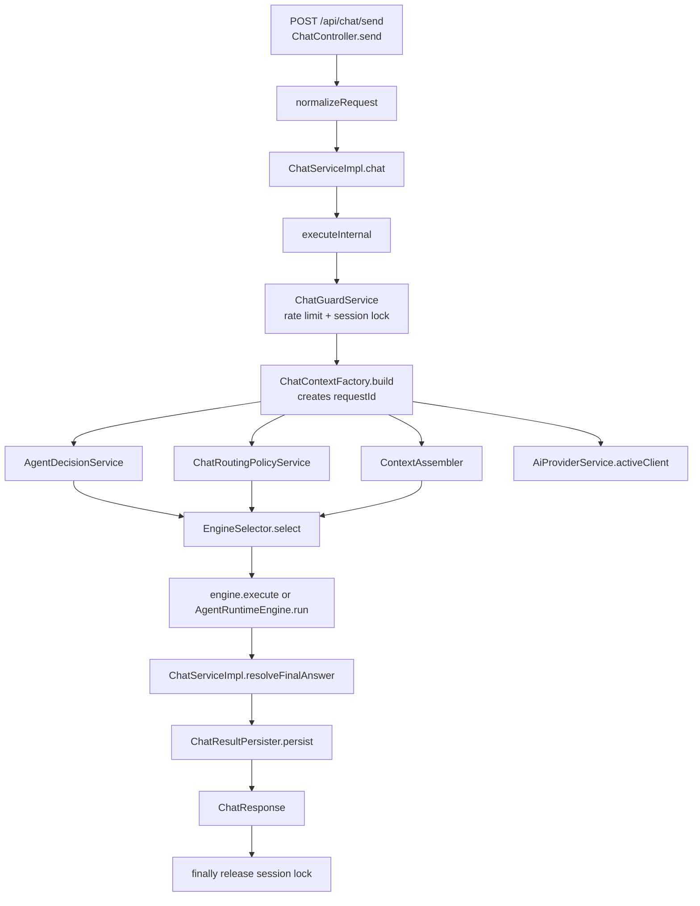
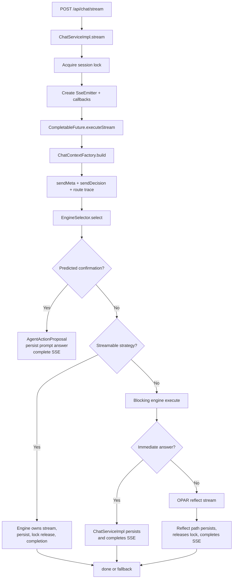
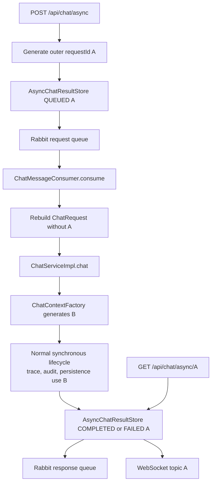
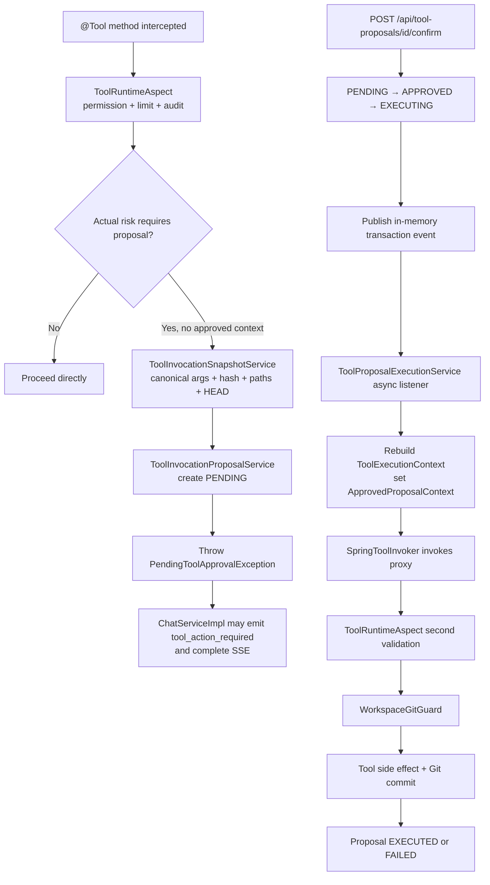
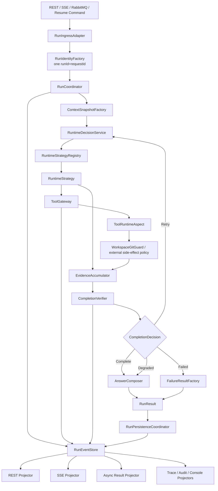
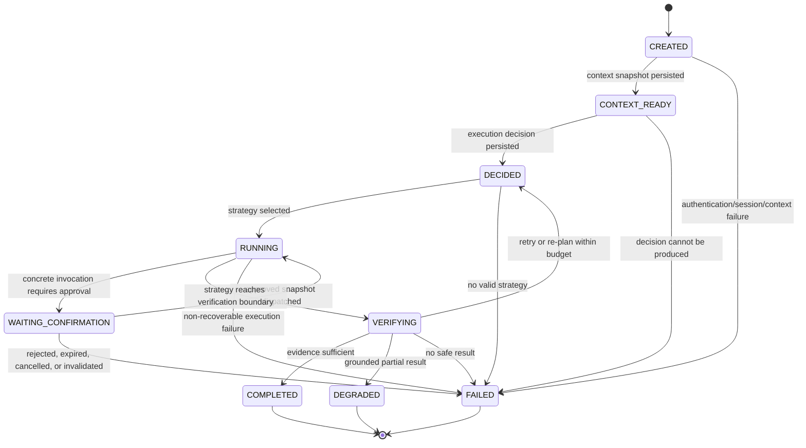
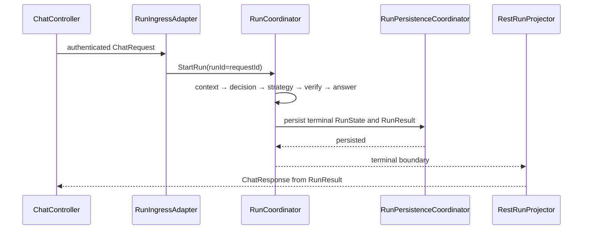
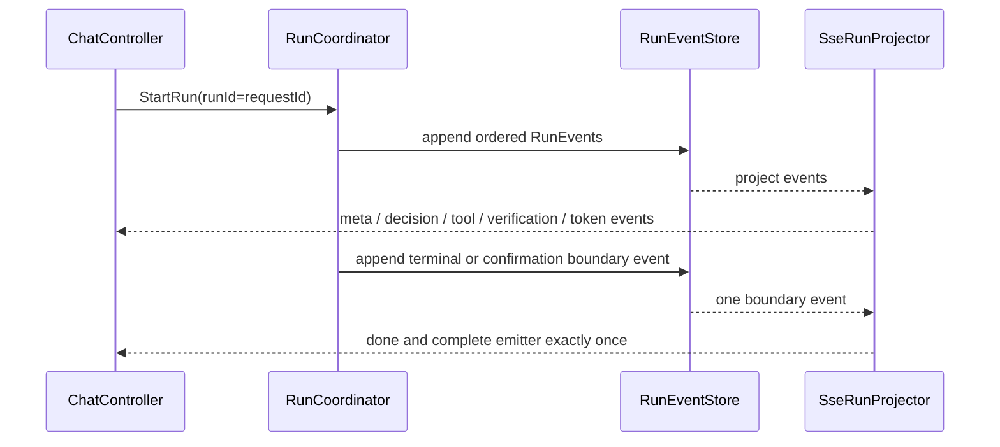
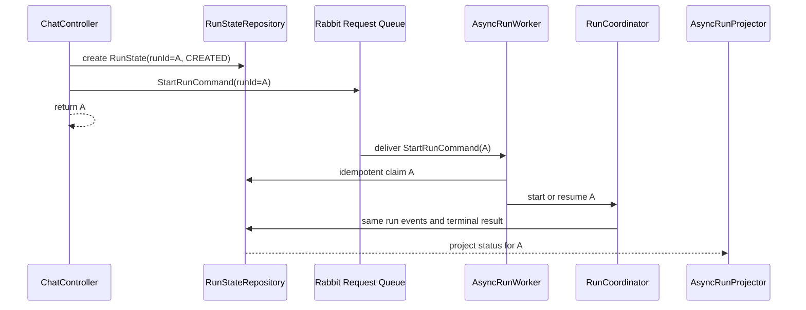
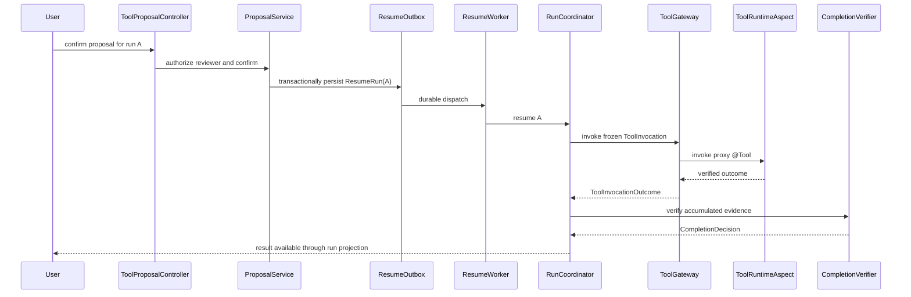

# Unified Agent Runtime Design

> Date: 2026-06-18  
> Branch: `codex/unified-agent-runtime`  
> Coordination base: `36ca396`  
> Design baseline: `95cc5f7`  
> Status: Phase 1 architecture specification; production implementation remains blocked until user approval

## 1. Executive Decision

SpringClaw will converge on one canonical `RunState` lifecycle for synchronous REST, SSE, RabbitMQ asynchronous execution, and tool-confirmation resume.

The target architecture has these properties:

1. One external request creates one canonical run identifier.
2. `requestId` remains the compatibility field name, but it must equal `runId`.
3. One `RunCoordinator` owns lifecycle transitions.
4. One immutable `ContextSnapshot` is assembled before execution and shared by every strategy.
5. One `ExecutionDecision` selects a `RuntimeStrategy`; strategies do not route themselves.
6. Every actual tool invocation enters `ToolGateway`, and every `@Tool` method still passes through `ToolRuntimeAspect`.
7. One `CompletionVerifier` decides whether business work is complete.
8. One `AnswerComposer` creates final user-facing text from verified evidence.
9. One persistence pipeline writes run, steps, tool invocations, conversation, memory, usage, and audit projections.
10. REST, SSE, RabbitMQ, WebSocket, and runtime-console views project the same run events.

The number of engine or strategy implementations is not an architectural target. Existing engines remain available through compatibility adapters until their behavior is characterized and migrated. An engine is removed only when its responsibility has a single replacement owner and compatibility acceptance passes.

## 2. Scope

### 2.1 Included

- Current lifecycle maps for:
  - synchronous chat;
  - SSE streaming chat;
  - RabbitMQ asynchronous chat;
  - tool proposal confirmation and resumed execution.
- Current and target responsibility ownership.
- Canonical runtime contracts.
- Run state machine and confirmation-resume semantics.
- Incremental migration, compatibility acceptance, deletion targets, and rollback boundaries.
- Explicit preservation of P0 confirmation, argument hashing, path validation, workspace safety, trace, audit, context, and persistence behavior.
- Transport parity and canonical identifier rules.

### 2.2 Excluded from this phase

- Production Java changes.
- Engine deletion.
- Frontend protocol changes.
- Database migrations.
- Implementation-plan authoring.
- Repairing the current runtime defects identified by the audit.

Those changes require separate approved implementation plans after the Phase 1 review gate.

## 3. Current-State Findings

### 3.1 Existing runtime implementations

`EngineSelector` currently selects the first matching `AgentEngine` by ascending priority.

| Priority | Engine | Current selection rule |
|---:|---|---|
| 1 | `BasicStreamEngine` | simplified mode, `agent` or `fast`, general intent, model available |
| 2 | `AutonomousLoopEngine` | OPAR mode, non-general, model available, risk is `write`, `side_effect`, or `dangerous` |
| 2 | `AgentRuntimeEngine` | non-general, no predicted confirmation, not dangerous, not OPAR |
| 3 | `OparLoopEngine` | OPAR mode or automatic upgrade |
| 5 | `ModelLedStreamEngine` | feature enabled, simplified, non-general, no backend capability requirement |
| 10 | `SimplifiedOparEngine` | unconditional fallback |

Equal priority between `AutonomousLoopEngine` and `AgentRuntimeEngine` makes bean-list order part of routing behavior. More importantly, routing is not actually owned only by `EngineSelector`: `AgentDecisionService`, `ChatRoutingPolicyService`, every engine's `supports()`, and branches in `ChatServiceImpl` all influence the effective path.

### 3.2 Duplicated sources of truth

The audit identified these active duplicates:

- Intent and route:
  - `AgentDecisionService`;
  - `AgentDecisionRouter`;
  - `ChatRoutingPolicyService`;
  - `AgentEngine.supports()`;
  - `ChatServiceImpl` confirmation and stream branches.
- Confirmation:
  - in-memory `AgentActionProposal`;
  - database-backed `ToolInvocationProposal`.
- Final answer:
  - `ChatServiceImpl.resolveFinalAnswer()`;
  - `MetaGuardExecutor`;
  - `AgentRuntimeEngine.summarize()` and deterministic rendering;
  - `AutonomousLoopEngine.resolveFinalAnswer()`;
  - `BasicStreamEngine`;
  - `ModelLedStreamEngine`;
  - OPAR reflection streaming.
- Persistence:
  - `ChatServiceImpl`;
  - three streamable engines;
  - `ChatResultPersister`;
  - `SseEventBridge`;
  - `AgentRunTraceService`;
  - `MessageEventToolAuditService`.
- Completion:
  - model stream completion;
  - non-empty `reflect`;
  - `TASK_COMPLETE`;
  - `AutonomousExecutionTracker`;
  - `VerificationResult.sufficient`;
  - successful capability return;
  - fallback completion branches.
- Stream termination and lock release:
  - `ChatServiceImpl`;
  - `BasicStreamEngine`;
  - `ModelLedStreamEngine`;
  - `AutonomousLoopEngine`;
  - emitter callbacks.

### 3.3 Identifier break

Synchronous and SSE requests receive an internal identifier from `ChatContextFactory`.

RabbitMQ asynchronous chat currently creates:

- outer asynchronous result identifier `A` in `ChatController.sendAsync()`;
- internal runtime identifier `B` in `ChatContextFactory.build()` after the consumer reconstructs `ChatRequest`.

The client polls `A`, while trace, proposal, audit, model usage, and persisted conversation use `B`. `runId` is generally null because most tool contexts use the five-argument `ToolExecutionContext` constructor.

Target invariant:

```text
requestId == runId == identifier accepted by the transport
```

No transport, context factory, engine, retry, or resume path may generate a second lifecycle identifier.

### 3.4 Confirmation break

The current system has two unrelated proposal models.

`AgentActionProposal`:

- is created from predicted intent risk before a concrete tool call exists;
- is stored in a JVM map;
- can create a scheduled task;
- cannot resume a general guarded action and returns `executed=false`.

`ToolInvocationProposal`:

- is created at the actual `@Tool` invocation boundary;
- freezes tool name, canonical arguments, argument hash, target paths, risk, user, request, and Git baseline;
- persists a state machine in MySQL;
- resumes the frozen tool call through `ToolInvoker`;
- re-enters `ToolRuntimeAspect` and `WorkspaceGitGuard`.

The target runtime retains only concrete invocation authorization for runtime tool side effects. Scheduled-task creation may keep a separate domain-specific approval object, but it must not claim ownership of general runtime tool confirmation.

### 3.5 Safety gaps discovered during characterization

The unified design must preserve existing P0 controls and close these gaps during the tool-gateway migration:

- unrelated user-staged files can be included by a normal Git commit;
- concurrent confirmed proposals can mutate the same repository without a workspace mutation lease;
- a timed-out proposal can be marked failed while its tool thread continues and later commits;
- execution resume relies on an in-memory transaction event rather than a durable dispatch record;
- multiple engines can swallow `PendingToolApprovalException`, leaving a pending row without a confirmation event;
- confirmed execution does not persist the actual tool return value or continue final-answer composition;
- `agent_run` does not own `WAITING_CONFIRMATION`;
- session ownership is checked by history reads but not consistently before send, stream, or async execution;
- asynchronous result polling and WebSocket topics are not bound to the authenticated owner;
- lexical path normalization does not fully protect against symlink escape.

These findings are implementation requirements, not reasons to weaken the existing safety boundary.

## 4. Current Request Lifecycles

### 4.1 Synchronous chat



Current owners:

- request identity: `ChatContextFactory`;
- route: `AgentDecisionService`, `ChatRoutingPolicyService`, `EngineSelector`, engine `supports()`;
- final answer: engine plus `ChatServiceImpl`;
- persistence: `ChatServiceImpl` through `ChatResultPersister`;
- lock termination: `ChatServiceImpl.executeInternal()` finally block;
- run terminal status: usually missing because non-SSE paths do not reliably emit a final trace.

### 4.2 SSE streaming chat



Current owners:

- stream lifecycle: `ChatServiceImpl` and streamable engines;
- persistence: `ChatServiceImpl`, `BasicStreamEngine`, `ModelLedStreamEngine`, `AutonomousLoopEngine`;
- termination: `SseEventBridge.completeEmitter()`, engine release methods, timeout callbacks;
- cancellation: only Reactor-backed streams reliably receive a `Disposable`; blocking runtime work can continue after disconnect;
- trace metadata and final status: substantially more complete than synchronous chat.

### 4.3 RabbitMQ asynchronous chat



Current owners:

- transport status: `AsyncChatResultStore`;
- business execution: synchronous `ChatServiceImpl`;
- result notification: `ChatMessageConsumer`;
- trace and business persistence: inner identifier `B`;
- failure status: one broad consumer catch block can overwrite completed business work when notification fails;
- idempotency: absent;
- timeout: absent at end-to-end run level;
- response queue: no in-repository consumer.

### 4.4 Tool confirmation and resumed execution



Current owners:

- proposal lifecycle: `ToolInvocationProposalService` and repository;
- durable frozen invocation: `ToolInvocationProposal`;
- dispatch: non-durable Spring application event;
- final safety gate: `ToolRuntimeAspect`;
- file-side-effect guard: `WorkspaceGitGuard`;
- run lifecycle: not updated to waiting, resumed, completed, degraded, or failed;
- user result: no active run continuation and no guaranteed notification.

## 5. Target Architecture



### 5.1 Target component ownership

- `RunIngressAdapter`: normalizes transport input and authenticated identity; does not execute business logic.
- `RunIdentityFactory`: creates or accepts the only run identifier.
- `RunCoordinator`: owns state transitions and invokes each stage.
- `ContextSnapshotFactory`: validates session ownership and creates one immutable context snapshot.
- `RuntimeDecisionService`: owns intent, risk summary, capability selection, and strategy requirements.
- `RuntimeStrategyRegistry`: selects exactly one strategy from a decision.
- `RuntimeStrategy`: executes model/capability work and returns evidence/events; it cannot persist, compose final answers, terminate transports, or select itself.
- `ToolGateway`: creates concrete invocation proposals, resumes approved invocations, and returns tool outcomes.
- `ToolRuntimeAspect`: remains the final AOP safety gate for every `@Tool`.
- `CompletionVerifier`: is the only business-completion authority.
- `AnswerComposer`: is the only final-answer authority.
- `RunPersistenceCoordinator`: persists the canonical result and projections.
- `RunEventStore`: appends ordered run events.
- transport projectors: render events and results without changing run state.

## 6. Responsibility Source-of-Truth Matrix

| Responsibility | Current owners | Target owner | Disabled or deleted after migration |
|---|---|---|---|
| Request/run identity | `ChatController.sendAsync`, `ChatContextFactory` | `RunIdentityFactory` | UUID generation in `ChatContextFactory`; independent async ID generation |
| Routing | `AgentDecisionRouter`, `AgentDecisionService`, `ChatRoutingPolicyService`, `EngineSelector`, engine `supports()`, `ChatServiceImpl` branches | `RuntimeDecisionService` + `RuntimeStrategyRegistry` | business routing in `ChatRoutingPolicyService`; self-routing engine conditions; route branches in `ChatServiceImpl` |
| Risk and confirmation | predicted `AgentDecision.requiresConfirmation`, `AgentActionProposalService`, `ToolRuntimeAspect`, `ToolInvocationProposalService` | `ToolGateway` for concrete invocation authorization; `ToolRuntimeAspect` as final enforcement | general guarded-action path in `AgentActionProposalService`; intent-only runtime confirmation |
| Context | `ChatContextFactory`, `ContextAssembler`, `ContextInjection`, Advisors, engine-specific prompt assembly | `ContextSnapshotFactory`; Advisors only project the snapshot | direct context assembly inside legacy paths; engine-specific retrieval |
| Capability/tool execution | model-native tool paths, `CapabilityExecutorRegistry`, local fallbacks, OPAR loops, `ToolOrchestrator` | selected `RuntimeStrategy` through `ToolGateway` | direct `@Tool` invocation paths that bypass gateway context; capability-specific fallback routers |
| Completion | stream completion, `TASK_COMPLETE`, `AutonomousExecutionTracker`, `VerificationResult`, engine return conditions | `CompletionVerifier` | engine-owned terminal claims; final-text and finish-reason completion |
| Final answer | engine renderers, `ChatServiceImpl.resolveFinalAnswer`, `MetaGuardExecutor`, runtime summary and fallback branches | `AnswerComposer` | engine-owned final text; `ChatServiceImpl.resolveFinalAnswer` |
| Persistence | engines, `ChatServiceImpl`, `ChatResultPersister`, trace and audit services | `RunPersistenceCoordinator` fed by `RunState` and `RunEvent` | engine persistence calls; transport-triggered persistence |
| Trace/audit | `SseEventBridge`, `AgentRunTraceService`, `MessageEventToolAuditService`, engine capability trace | `RunEventStore` with trace/audit projectors | duplicate capability-to-trace writes; SSE as trace persistence trigger |
| Stream termination | `ChatServiceImpl`, streamable engines, emitter callbacks | `SseRunProjector`, reacting once to a coordinator boundary event | engine lock release and emitter completion |

## 7. Canonical Domain Contracts

### 7.1 `RunStatus`

Responsibility:

- defines lifecycle states and terminality.

Values:

```text
CREATED
CONTEXT_READY
DECIDED
WAITING_CONFIRMATION
RUNNING
VERIFYING
COMPLETED
DEGRADED
FAILED
```

Terminal states:

```text
COMPLETED
DEGRADED
FAILED
```

Producer:

- only `RunCoordinator` through `RunReducer`.

Consumers:

- persistence and transport projectors;
- runtime console;
- resume dispatcher;
- cleanup and recovery jobs.

Forbidden responsibilities:

- it does not encode proposal status;
- it does not encode transport status;
- it does not prove business completion without a `CompletionDecision`.

### 7.2 `RunState`

Responsibility:

- canonical aggregate for one user request from acceptance through a terminal result or suspended confirmation boundary.

Required fields:

```text
runId
requestId
revision
status
sessionKey
channel
userId
roleCodeAtAcceptance
originalMessage
responseMode
acceptedAt
startedAt
updatedAt
finishedAt
deadlineAt
contextSnapshot
executionDecision
strategyId
attempt
pendingProposalId
toolInvocations
completionDecision
result
usage
failure
```

Invariants:

- `runId` and `requestId` are non-empty and equal.
- `revision` increases for every accepted transition.
- terminal states are immutable.
- `WAITING_CONFIRMATION` has a non-empty `pendingProposalId`.
- `COMPLETED` and `DEGRADED` have a `RunResult`.
- `FAILED` has a typed failure.
- transport delivery state is not stored as business run status.

Producer:

- `RunCoordinator`, reduced from accepted `RunEvent` values.

Consumers:

- strategies receive a read-only view;
- completion and answer services;
- persistence and projectors;
- resume and recovery services.

Forbidden responsibilities:

- no direct database access;
- no model or tool invocation methods;
- no transport emitter or RabbitMQ object;
- no mutable engine-private completion flag.

### 7.3 `ContextSnapshot`

Responsibility:

- immutable, explainable snapshot of all context authorized for this run.

Required fields:

```text
runId
sessionKey
sessionOwnerUserId
channel
userId
roleCode
originalMessage
effectiveMessage
systemPrompt
memoryBankText
shortTermEvents
semanticRecallItems
activeLearningRules
allowedCapabilities
providerSnapshot
contextSourceSummary
capturedAt
snapshotHash
```

Producer:

- `ContextSnapshotFactory`.

Consumers:

- `RuntimeDecisionService`;
- selected strategy;
- Advisors that project the exact snapshot into model requests;
- trace and audit projectors.

Forbidden responsibilities:

- no late memory retrieval by an Advisor;
- no route decision;
- no tool execution;
- no mutation after `CONTEXT_READY`;
- no session read before ownership validation.

Advisor rule:

> Advisors may format or attach `ContextSnapshot` content. They may not independently retrieve a second memory view that changes the run's semantic context.

### 7.4 `ExecutionDecision`

Responsibility:

- normalized execution decision made from the accepted input, context snapshot, capability catalog, model availability, and policy summary.

Required fields:

```text
runId
intent
goal
responseMode
riskSummary
selectedCapabilityIds
requestedInvocations
strategyRequirements
missingInputs
confidence
reason
decisionSource
decidedAt
```

Producer:

- `RuntimeDecisionService`.

Consumers:

- `RuntimeStrategyRegistry`;
- `CompletionVerifier`;
- trace and evaluation.

Forbidden responsibilities:

- it cannot authorize a side effect;
- `riskSummary` cannot replace actual invocation risk classification;
- it cannot mark a run complete;
- it cannot contain transport behavior.

### 7.5 `RuntimeStrategy`

Responsibility:

- execute one selected runtime approach and emit evidence-bearing events.

Contract:

```java
public interface RuntimeStrategy {
    String strategyId();
    StrategyCapabilities capabilities();
    StrategyExecution execute(RunExecutionContext context);
    StrategyExecution resume(RunExecutionContext context, ToolInvocationOutcome outcome);
}
```

`StrategyExecution` returns:

```text
events
evidence
requestedToolInvocation
modelUsage
continuationToken
strategyFailure
```

Producer:

- implementations include legacy adapters and later native strategies.

Consumers:

- only `RunCoordinator`.

Forbidden responsibilities:

- no self-selection from raw user text;
- no run-status mutation;
- no direct persistence;
- no final-answer ownership;
- no transport completion;
- no session-lock release;
- no direct write-tool execution outside `ToolGateway`.

### 7.6 `ToolInvocation`

Responsibility:

- immutable description and lifecycle reference for one actual capability operation.

Required fields:

```text
invocationId
runId
attempt
capabilityId
operationId
toolName
toolsetId
canonicalArgumentsJson
argumentsHash
riskLevel
targetPaths
expectedEvidence
idempotencyKey
status
proposalId
startedAt
finishedAt
outcome
```

Producer:

- selected strategy requests an invocation;
- `ToolGateway` normalizes and freezes it.

Consumers:

- `ToolRuntimeAspect`;
- proposal repository;
- `WorkspaceGitGuard`;
- evidence and audit projectors;
- `CompletionVerifier`.

Forbidden responsibilities:

- no user-facing final answer;
- no implicit approval from `ExecutionDecision`;
- no mutable argument set after proposal creation;
- no invocation without run ownership and authenticated user context.

### 7.7 `CompletionDecision`

Responsibility:

- sole declaration of whether the run may finish, retry, degrade, fail, or wait.

Required fields:

```text
runId
outcome
reasonCode
summary
evidenceRefs
missingEvidence
retryAllowed
nextAttempt
quality
decidedAt
```

Allowed outcomes:

```text
COMPLETE
RETRY
DEGRADE
FAIL
WAIT_FOR_CONFIRMATION
```

Producer:

- `CompletionVerifier`.

Consumers:

- `RunCoordinator`;
- `AnswerComposer` for complete or degraded output;
- trace and evaluation projectors.

Forbidden responsibilities:

- no final text generation;
- no direct state persistence;
- no inference from `finishReason`, non-empty text, missing tool calls, or `TASK_COMPLETE` alone;
- no successful write completion without successful invocation evidence and policy checks.

### 7.8 `RunResult`

Responsibility:

- immutable terminal result projected to every transport.

Required fields:

```text
runId
status
answer
answerKind
modelProvider
modelId
evidenceRefs
toolInvocationIds
quality
usage
failureCode
failureMessage
completedAt
```

Producer:

- `AnswerComposer` for `COMPLETED` and `DEGRADED`;
- `FailureResultFactory` for `FAILED`.

Consumers:

- `RunPersistenceCoordinator`;
- REST, SSE, async, WebSocket, and console projectors.

Forbidden responsibilities:

- no new model or tool call;
- no transport-specific status;
- no hidden answer replacement after persistence.

### 7.9 `RunEvent`

Responsibility:

- ordered, append-only fact describing one accepted runtime transition or observation.

Required fields:

```text
eventId
runId
sequence
eventType
stage
status
timestamp
durationMs
payloadSchema
payload
causationId
correlationId
```

Required event families:

```text
run.created
context.ready
decision.made
strategy.started
model.called
tool.requested
confirmation.required
confirmation.approved
confirmation.rejected
tool.started
tool.succeeded
tool.failed
verification.completed
answer.composed
run.completed
run.degraded
run.failed
delivery.attempted
delivery.failed
```

Producer:

- stage owners submit typed facts to `RunCoordinator` or `RunEventStore`;
- sequence assignment belongs to `RunEventStore`.

Consumers:

- `RunReducer`;
- persistence, audit, trace, usage, and transport projectors.

Forbidden responsibilities:

- an event does not mutate state by itself;
- transport delivery failure cannot rewrite a terminal business event;
- duplicate delivery must be idempotent by `eventId`.

## 8. Run State Machine



### 8.1 Valid transitions

| From | To | Owner | Required evidence |
|---|---|---|---|
| absent | `CREATED` | `RunCoordinator` | authenticated input and unique identifier |
| `CREATED` | `CONTEXT_READY` | `RunCoordinator` | persisted `ContextSnapshot` |
| `CREATED` | `FAILED` | `RunCoordinator` | typed authentication, ownership, or context failure |
| `CONTEXT_READY` | `DECIDED` | `RunCoordinator` | persisted `ExecutionDecision` |
| `CONTEXT_READY` | `FAILED` | `RunCoordinator` | typed decision failure |
| `DECIDED` | `RUNNING` | `RunCoordinator` | exactly one selected strategy |
| `DECIDED` | `FAILED` | `RunCoordinator` | no allowed strategy |
| `RUNNING` | `WAITING_CONFIRMATION` | `RunCoordinator` | persisted concrete `ToolInvocationProposal` |
| `WAITING_CONFIRMATION` | `RUNNING` | `RunCoordinator` | approved frozen snapshot and durable resume command |
| `WAITING_CONFIRMATION` | `FAILED` | `RunCoordinator` | rejection, expiry, cancellation, baseline invalidation, or authorization failure |
| `RUNNING` | `VERIFYING` | `RunCoordinator` | strategy execution boundary and evidence bundle |
| `RUNNING` | `FAILED` | `RunCoordinator` | non-retryable execution failure |
| `VERIFYING` | `DECIDED` | `RunCoordinator` | `CompletionDecision.RETRY` and remaining budget |
| `VERIFYING` | `COMPLETED` | `RunCoordinator` | `CompletionDecision.COMPLETE` plus `RunResult` |
| `VERIFYING` | `DEGRADED` | `RunCoordinator` | `CompletionDecision.DEGRADE` plus grounded `RunResult` |
| `VERIFYING` | `FAILED` | `RunCoordinator` | `CompletionDecision.FAIL` plus typed failure result |

### 8.2 Retry semantics

- A retry stays on the same `runId`.
- `attempt` increments.
- Previous decisions, invocations, evidence, and events remain immutable.
- A retry creates new invocation identifiers and idempotency keys.
- A failed or expired proposal is never reused.
- Retry budgets include model calls, tool calls, elapsed time, and policy limits.
- Provider failover records a new model-call event but does not create a new run.

### 8.3 Confirmation resume semantics

1. A strategy requests a concrete `ToolInvocation`.
2. `ToolGateway` canonicalizes arguments and resolves actual risk.
3. If confirmation is required, `ToolGateway` persists a frozen proposal and returns a suspended execution result.
4. `RunCoordinator` transitions `RUNNING → WAITING_CONFIRMATION`.
5. The active execution lease and session lock are released.
6. SSE may complete after emitting `confirmation.required`; the run itself remains non-terminal.
7. Confirm validates owner or privileged reviewer, reviewer identity, expiry, run status, proposal status, argument hash, path scope, and baseline.
8. Confirm transaction persists:
   - proposal transition to executable state;
   - `confirmation.approved`;
   - a durable resume dispatch record.
9. The resume worker claims the dispatch record once, reconstructs trusted execution context, and invokes the frozen snapshot without re-running the model.
10. `ToolRuntimeAspect` re-checks database state and arguments.
11. Tool outcome is appended to the same run.
12. `RunCoordinator` resumes the strategy continuation, verifies evidence, composes the answer, and reaches a terminal state.

Reject, expiry, cancellation, authorization failure, or baseline invalidation transitions the run to `FAILED` with an explicit reason. They do not silently create a generic assistant answer.

### 8.4 Failure ownership

Only `RunCoordinator` may transition a run to `FAILED`.

Other components return or emit typed failures:

```text
AUTHENTICATION_FAILED
SESSION_OWNERSHIP_VIOLATION
CONTEXT_ASSEMBLY_FAILED
DECISION_FAILED
NO_STRATEGY
MODEL_UNAVAILABLE
TOOL_DENIED
CONFIRMATION_REJECTED
CONFIRMATION_EXPIRED
PROPOSAL_INVALIDATED
TOOL_EXECUTION_FAILED
WORKSPACE_BASELINE_CHANGED
WORKSPACE_SCOPE_VIOLATION
VERIFICATION_FAILED
ANSWER_COMPOSITION_FAILED
RUN_DEADLINE_EXCEEDED
```

Delivery failures are not run failures after a terminal result exists. They create `delivery.failed` events and are retried by transport infrastructure.

## 9. Target Request Lifecycles

### 9.1 Synchronous REST



If the run reaches `WAITING_CONFIRMATION`, REST returns an action-required projection referencing the same `runId`. It must not convert the suspension into HTTP 500.

### 9.2 SSE



The strategy cannot receive `SseEmitter`, lock tokens, or completion callbacks.

### 9.3 RabbitMQ asynchronous chat



Rules:

- the queue message carries the accepted `runId`;
- the context factory cannot generate another identifier;
- repeated delivery claims the same run and does not duplicate completed work;
- notification failure cannot change a completed run to failed;
- poll and WebSocket access validate run ownership;
- async timeout creates a typed run deadline failure rather than disappearing at cache expiry;
- response delivery uses a durable outbox or equivalent idempotent projector.

### 9.4 Confirmation resume



## 10. P0 Safety Enforcement Map

| Safety invariant | Target enforcement point |
|---|---|
| Actual write/dangerous calls require confirmation | `ToolGateway` creates proposal from concrete invocation; `ToolRuntimeAspect` rejects missing approved context |
| No side effect before approval | proposal branch returns without calling `ProceedingJoinPoint.proceed()` |
| Frozen tool and arguments | immutable `ToolInvocation` and proposal snapshot |
| Canonical argument fingerprint | `ToolGateway` canonicalizer; `ToolRuntimeAspect` recomputes hash |
| Trusted approval context only | resume worker constructs backend context from persisted run and proposal |
| Database state re-check | `ToolRuntimeAspect` requires current executable proposal and matching fencing token |
| Target path normalization | path service resolves repo-relative path and rejects lexical or symlink escape |
| Dirty target rejection | snapshot creation and execution-time baseline check |
| HEAD consistency | `WorkspaceGitGuard` checks create-time baseline before execution |
| Scope of actual file changes | post-execution diff must be a subset of authorized paths |
| User dirty files preserved | workspace snapshots and rollback cannot touch pre-existing non-target changes |
| User staged files excluded | `GitOperations.commitAuthorizedPaths` uses an isolated temporary index under a repository mutation lease |
| Concurrent proposal isolation | one repository-scoped `WorkspaceMutationLease` with fencing token |
| No-op write | proposal becomes executed with null commit SHA |
| Tool exception rollback | authorized target changes and newly created out-of-scope files are restored or deleted |
| Timeout cannot commit later | cancellation plus fencing-token/status checks immediately before staging, commit, and terminal proposal update |
| Stuck execution is not replayed blindly | recovery marks uncertain execution failed; a new proposal is required |
| Resume path still hits AOP | integration test verifies proxy invocation reaches `ToolRuntimeAspect` |
| Confirm does not re-run model | only frozen invocation and saved strategy continuation are resumed |
| Reviewer is auditable | proposal stores reviewer user ID, role, timestamp, and reason |
| Run and proposal state agree | `RunCoordinator` owns `WAITING_CONFIRMATION` and consumes proposal terminal events |
| Durable resume | confirm writes a resume outbox record in the same transaction |
| External side effects | capability-specific idempotency key and compensating policy are required; Git evidence alone is insufficient |

## 11. Transport and Persistence Rules

### 11.1 Canonical persistence order

For every state transition:

1. validate expected `RunState.revision`;
2. append one or more ordered `RunEvent` rows;
3. reduce and persist the new `RunState`;
4. persist stage-specific records such as tool invocation, usage, or proposal;
5. create projector outbox records;
6. commit;
7. deliver transport projections asynchronously or inline according to the transport.

The run event and state write must share one transaction when database persistence is enabled.

### 11.2 Conversation and memory persistence

Conversation and memory writes consume terminal `RunResult`:

- `COMPLETED`: persist normal assistant answer and reusable evidence.
- `DEGRADED`: persist answer with degraded metadata; memory must not promote uncertain claims.
- `FAILED`: persist a concise failure turn only when product behavior requires it; do not store fabricated success.
- `WAITING_CONFIRMATION`: persist the user turn and suspension event, not a fake completed assistant turn.

### 11.3 Trace and audit

- `RunEventStore` assigns sequence numbers.
- Tool audit START and terminal events remain paired.
- A logical invocation has one `ToolInvocation` projection; START and terminal events update or project that invocation rather than creating unrelated duplicate invocation rows.
- SSE emission is not a prerequisite for trace persistence.
- Every terminal run has one terminal run event and one final result.
- `PENDING_APPROVAL` is a waiting state, not success.

### 11.4 Stream termination

`SseRunProjector` completes an emitter exactly once when it observes:

- `run.completed`;
- `run.degraded`;
- `run.failed`;
- `confirmation.required` as a transport suspension boundary.

Only the projector holds the emitter. Runtime strategies cannot release session locks or complete streams.

### 11.5 Locks and leases

- `RunLeaseService` protects active execution of a run.
- A run lease is released when the run suspends for confirmation.
- `WorkspaceMutationLease` serializes repository mutations and supplies a fencing token.
- A transport disconnect cancels its subscription but does not silently declare the run failed.
- The coordinator receives cancellation only when product policy explicitly cancels the run.
- Lease TTLs require renewal for long-running work.

## 12. Incremental Migration and Rollback

Each phase moves one responsibility or one tightly coupled safety boundary. The replacement becomes active and the old owner is disabled in the same phase. Compatibility adapters are temporary and have explicit removal gates.

### 12.1 Phase 1 — Runtime domain contracts

Deliverable:

- `RunStatus`, `RunState`, `ContextSnapshot`, `ExecutionDecision`, `RuntimeStrategy`, `ToolInvocation`, `CompletionDecision`, `RunResult`, and `RunEvent`.

Behavior:

- no production routing changes;
- adapters translate existing records into contract fixtures for tests.

Compatibility acceptance:

- serialization and invariant tests;
- current six-engine route characterization remains unchanged;
- no existing API change.

Rollback unit:

- remove the new isolated contract package and tests.

Old owner disabled:

- none, because no runtime responsibility moves in this phase.

### 12.2 Phase 2A — Canonical identity

Deliverable:

- `RunIdentityFactory`;
- transport commands that carry the accepted identifier through sync, SSE, async, and resume paths.

Migrated responsibility:

- request/run identity.

Old owner disabled in the same phase:

- UUID creation in `ChatContextFactory`;
- independent async runtime identifier generation.

Compatibility acceptance:

- sync, SSE, async, and proposal rows use one identifier;
- repeated async delivery does not create a second run;
- existing tool audit receives non-null run ownership.

Rollback unit:

- revert transport command changes and restore old identifier generation together.

### 12.3 Phase 2B — Canonical lifecycle and legacy runtime bridge

Deliverable:

- `RunCoordinator`;
- `RunStateRepository`;
- core `RunEventStore`;
- `LegacyRuntimeStrategy`;
- compatibility adapter from `RunResult` to current `ChatResponse`.

Migrated responsibility:

- canonical run lifecycle state.

Old owner disabled in the same phase:

- `AgentRunTraceService.toRunStatus()` as an authoritative run-status writer;
- transport-specific business-status stores as independent lifecycle authorities.

Bridge ownership rule:

- legacy trace may remain diagnostic, but only `RunCoordinator` changes canonical `RunStatus`;
- `LegacyRuntimeStrategy` remains the sole owner of legacy routing, answer, persistence, and stream behavior until each later migration phase;
- `RunCoordinator` owns canonical revision and lifecycle boundary state;
- bridge translation cannot independently repair or replace a legacy answer.

Legacy routing-order freeze:

- before the bridge is activated, its compatibility metadata must record the characterized engine order as an explicit, version-controlled `legacyRank`: `basic-stream` (10), `agent-runtime` (20), `autonomous-loop` (30), `opar-loop` (40), `model-led-stream` (50), `simplified` (60);
- while legacy routing remains active, ties are resolved by `(priority, legacyRank)` so Spring bean-list order is no longer an implicit compatibility input;
- the two current priority-2 engines have mutually exclusive characterized `supports()` conditions, but the explicit rank still prevents future condition changes from silently changing tie behavior;
- class name, bean name, discovery order, or alphabetical order must not be invented as a new tie-break rule;
- Phase 3B removes this compatibility ordering when `RuntimeDecisionService` selects one exact strategy identifier.

Compatibility acceptance:

- current answers, engine selection, and transport payloads remain characterized;
- every accepted request has a canonical `RunState`;
- one lifecycle boundary event exists for create, confirmation suspension, and terminal outcome;
- legacy trace cannot overwrite a terminal canonical status.

Rollback unit:

- revert coordinator ingress, lifecycle repository, and legacy adapter activation together; retain identifier propagation from Phase 2A.

### 12.4 Phase 3A — Canonical context ownership

Deliverable:

- `ContextSnapshotFactory`;
- Advisor projection of the saved snapshot.

Migrated responsibility:

- context retrieval and authorization.

Old owner disabled in the same phase:

- direct context assembly by `ChatContextFactory`;
- Advisor-side independent semantic retrieval;
- engine-specific context retrieval.

Compatibility acceptance:

- all six legacy strategies receive equivalent Memory Bank, short-term, semantic, learning, system-prompt, and capability data;
- snapshot hash is identical across transport projectors;
- session ownership violation is rejected before context read or write.

Rollback unit:

- restore legacy context factory and Advisor configuration as one commit set.

### 12.5 Phase 3B — Canonical decision ownership

Deliverable:

- `RuntimeDecisionService`;
- `RuntimeStrategyRegistry`;
- legacy-engine adapters with fixed strategy identifiers.

Migrated responsibility:

- routing and strategy selection.

Old owner disabled in the same phase:

- business route output from `ChatRoutingPolicyService`;
- engine self-selection from raw user text;
- route and confirmation branches in `ChatServiceImpl`.

`AgentDecisionRouter` may remain temporarily as an input adapter, but it cannot independently select a strategy after this phase.

Compatibility acceptance:

- route characterization cases match the approved compatibility table;
- one decision event and one strategy selection exist per attempt;
- no equal-priority bean-order routing;
- engine count remains unrestricted.

Rollback unit:

- revert decision service, registry, and adapter activation together.

### 12.6 Phase 4A — ToolGateway and proposal convergence

Deliverable:

- `ToolGateway`;
- durable resume dispatch;
- reviewer audit;
- workspace mutation lease and fencing;
- actual tool result persistence.

Migrated responsibility:

- runtime tool invocation and confirmation.

Old owner disabled in the same phase:

- `AgentActionProposalService` general `guarded_action` path;
- direct runtime tool invocation without `ToolGateway`;
- in-memory-only proposal resume dispatch.

Scheduled-task approval remains domain-specific and is renamed or isolated so it cannot be mistaken for runtime invocation authorization.

Compatibility acceptance:

- unapproved write has no side effect;
- confirm resumes the same run without a second model plan;
- every confirm resume passes through `ToolRuntimeAspect`;
- staged unrelated files are preserved and excluded from agent commit;
- concurrent workspace proposals cannot cross-commit;
- timeout cannot produce an unrecorded late commit;
- symlink escape is rejected;
- rejection and expiry update the same run.

Rollback unit:

- revert gateway activation, resume dispatcher, and proposal-controller routing together; retain database rows for audit.

### 12.7 Phase 4B — Canonical completion ownership

Deliverable:

- `CompletionVerifier`;
- adapters for legacy `VerificationResult`, `AutonomousExecutionTracker`, and OPAR evidence.

Migrated responsibility:

- business completion and retry decision.

Old owner disabled in the same phase:

- engine terminal claims from final text;
- direct `TASK_COMPLETE` acceptance;
- stream-finish success;
- non-empty `reflect` as completion proof.

Compatibility acceptance:

- read tasks complete from sufficient evidence;
- write tasks require successful authorized side-effect evidence;
- model `finishReason` cannot complete a run;
- fake completion is rejected;
- retry stays on the same run and increments attempt.

Rollback unit:

- revert verifier activation and restore legacy completion adapter as one unit.

### 12.8 Phase 5A — Canonical answer ownership

Deliverable:

- `AnswerComposer`;
- deterministic and model-summary composition modes;
- grounding post-check.

Migrated responsibility:

- final answer.

Old owner disabled in the same phase:

- `ChatServiceImpl.resolveFinalAnswer`;
- engine final renderers;
- separate OPAR reflect answer ownership;
- answer replacement in transport fallback branches.

Compatibility acceptance:

- deterministic direct evidence remains unsummarized where required;
- failed tools cannot be narrated as completed;
- complete, degraded, and failed answers are distinguishable;
- one answer is persisted and projected to every transport.

Rollback unit:

- revert composer activation and re-enable the single legacy answer adapter.

### 12.9 Phase 5B — Canonical terminal persistence

Deliverable:

- `RunPersistenceCoordinator`;
- conversation, memory, usage-summary, and terminal-result persistence.

Migrated responsibility:

- terminal result, conversation, memory, and usage-summary persistence.

Old owner disabled in the same phase:

- engine calls to `ChatResultPersister`;
- direct terminal persistence in `ChatServiceImpl`;
- transport-triggered conversation or memory persistence.

Compatibility acceptance:

- exactly one run row per run;
- one terminal event;
- sync, SSE, and async have equivalent terminal persistence;
- database-disabled local mode preserves an in-memory event-store contract.

Rollback unit:

- revert projector activation and restore old persister calls together.

### 12.10 Phase 5C — Canonical trace and audit projection

Deliverable:

- trace, audit, usage-detail, and tool-invocation projectors.

Migrated responsibility:

- trace and audit projection.

Old owner disabled in the same phase:

- transport-triggered metadata writes;
- duplicate capability trace generation;
- `MessageEventToolAuditService` as an independent run-step writer;
- multiple tool-invocation rows for one logical invocation.

Compatibility acceptance:

- monotonic event and step sequence;
- one route event and one terminal event;
- one logical invocation projection per invocation;
- tool START and terminal audit events remain paired;
- SSE presence or absence does not change trace persistence.

Rollback unit:

- revert canonical projector activation and restore legacy trace adapters together; canonical run state remains active.

### 12.11 Phase 5D — Output projectors and stream termination

Deliverable:

- `RestRunProjector`;
- `SseRunProjector`;
- `AsyncRunProjector`;
- owner-checked run query endpoints.

Migrated responsibility:

- transport rendering and termination.

Old owner disabled in the same phase:

- streamable-engine emitter access;
- engine lock release;
- consumer broad catch that rewrites business status after notification failure;
- anonymous async result polling and topic subscription.

Compatibility acceptance:

- same `RunResult.answer` across REST, SSE, and async;
- one `done` per SSE boundary;
- notification failure produces a delivery event, not business failure;
- async poll identifier retrieves the same trace;
- client disconnect does not create false completion.

Rollback unit:

- revert projector routing while preserving canonical run state and events.

### 12.12 Phase 6 — Legacy removal

Removal candidates after all acceptance gates pass:

- `ChatExecutionResult` as a cross-runtime result type;
- `ChatContext` as canonical runtime state;
- `AgentActionProposal` general guarded-action branch;
- engine-owned persistence and stream APIs;
- business routing in `ChatRoutingPolicyService`;
- duplicate final-answer methods;
- duplicate trace and tool-invocation projection paths;
- obsolete engine adapters whose internal behavior has been replaced.

Compatibility acceptance:

- full characterization suite passes or has an explicitly approved behavior change;
- no production reference to removed owners;
- P0 safety integration suite passes;
- four lifecycle acceptance suites pass;
- frontend builds against the stable projection protocol.

Rollback unit:

- legacy removal occurs in small deletion commits after replacement stability; each commit can be reverted independently without reactivating two owners.

## 13. Compatibility Acceptance Matrix

| Scenario | Required invariant |
|---|---|
| General synchronous chat | one run; no tool; one final result; session lock released |
| General SSE chat | same answer source as sync; ordered events; one done |
| Deep read analysis | strategy may differ; context and completion contracts remain identical |
| Write request | only actual invocation snapshot can request confirmation |
| Tool proposal confirm | same run resumes; no model re-plan; Aspect and Git guard execute |
| Tool proposal reject | no side effect; run fails with explicit rejection |
| Async chat | accepted ID equals trace/proposal/audit/run ID |
| Async redelivery | same run claimed idempotently; no duplicate conversation turn |
| Provider failover | same run, additional model-call event, actual provider recorded |
| Model unavailable | grounded degraded result, not fabricated success |
| Partial stream interruption | coordinator decides degraded or failed; transport cannot decide |
| Client disconnect | delivery stops; business run state follows cancellation policy |
| User dirty workspace | non-target changes and index state preserved |
| Concurrent confirmed writes | serialized by workspace mutation lease |
| Session-key collision | unauthorized user rejected before context retrieval |

## 14. Test Strategy for Implementation Plans

### 14.1 Contract tests

- run identifier equality and immutability;
- state transition table;
- terminal-state immutability;
- event ordering and idempotency;
- context snapshot immutability and source summary;
- forbidden strategy responsibilities enforced by API shape.

### 14.2 Characterization tests

- all current engine route examples;
- current context sources;
- current final-answer sites;
- current transport differences;
- current tool safety path.

Characterization failures must be reviewed as behavior changes, not weakened to make implementation pass.

### 14.3 P0 integration tests

- write without proposal is denied;
- args mismatch is denied;
- HEAD mismatch is denied;
- path mismatch and symlink escape are denied;
- confirmed invocation re-enters Aspect;
- staged unrelated files remain staged and excluded;
- concurrent proposals cannot cross-commit;
- timeout fencing prevents late commit;
- no-op execution is successful without empty commit;
- rollback preserves user dirty files.

### 14.4 Cross-transport tests

For one fixed decision and strategy fixture:

- REST, SSE, and async project the same run identifier;
- all persist the same `RunResult`;
- all persist equivalent trace and invocation rows;
- delivery failure does not mutate terminal business status;
- confirmation suspension and resume are queryable from every transport.

### 14.5 Recovery tests

- restart while `WAITING_CONFIRMATION`;
- restart after confirm transaction but before worker claim;
- duplicate resume dispatch;
- stuck execution with expired fencing token;
- async message redelivery;
- projector retry after run completion.

## 15. Architectural Rules

1. `ChatServiceImpl` becomes a transport facade and cannot perform business routing.
2. `RuntimeStrategy` implementations cannot receive transport objects.
3. Strategies cannot persist conversation, trace, or run status.
4. Strategies cannot declare completion.
5. `ExecutionDecision.requiresConfirmation` is advisory only; actual invocation risk controls authorization.
6. `ToolRuntimeAspect` remains mandatory for every `@Tool` call.
7. `WorkspaceGitGuard` remains mandatory for workspace mutations.
8. Context retrieval occurs once at `CREATED → CONTEXT_READY`; retries and confirmation resumes reuse that snapshot. A future refresh must be an explicit versioned transition, never a hidden Advisor retrieval.
9. Run retries and confirmation resumes keep the same run identifier.
10. A terminal answer is created once and projected many times.
11. Transport delivery failures never overwrite completed business work.
12. A migration phase cannot leave the old and new owner active for the same responsibility.
13. Compatibility adapters must expose a deletion criterion in their implementation plan.
14. Engine count is an implementation detail, not a success metric.

## 16. Phase 1 Review Gate

Production implementation remains unauthorized until:

- Claude's current-state audit and characterization commits are available;
- this design is reviewed against those tests;
- all P0 invariants have a named enforcement point;
- the user approves this specification;
- separate implementation plans are written for each migration boundary.

The first implementation plan after approval is `unified-runtime-domain-contracts`. It cannot include production behavior migration beyond the isolated contracts defined in Phase 1 of the migration section.
