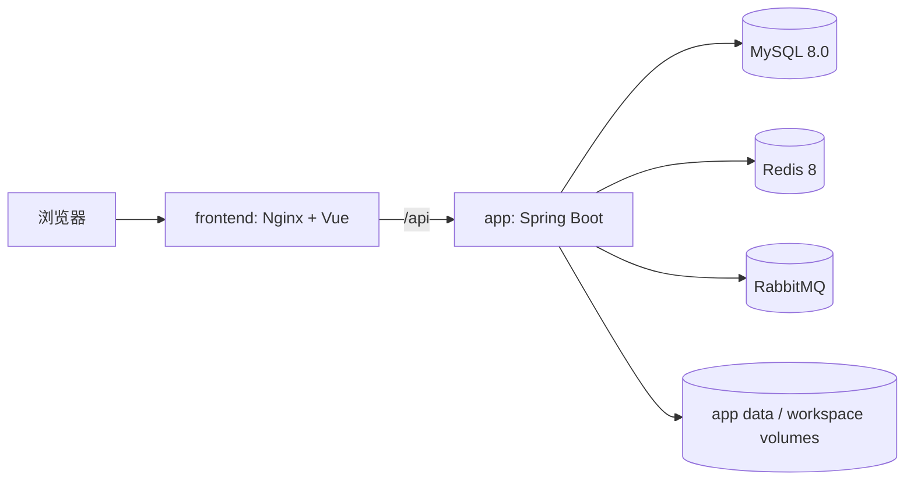

# SpringClaw 可部署交付设计

## 背景

SpringClaw 已有 Docker Compose、Flyway、Actuator 和 Vue 控制台，但这些资产尚未构成可复现交付：Compose 只启动后端与三项依赖，前端仍需手动运行；运行手册仍使用 `OPENCLAW_*` 旧变量并指向已不存在的 `schema.sql`；`.env.example`、本地 `.env.local` 和实际容器端口可以彼此不一致；应用容器没有健康检查。

本次收敛不改变 Agent、鉴权、记忆或工具协议。目标是让新成员能用明确的配置来源，在本地开发或单机自托管两种场景下启动同一产品，并能用健康检查和运行手册确认状态。

## 目标与非目标

### 目标

- `docker compose up -d --build` 启动完整可访问的单机版本：前端、后端、MySQL、Redis 和 RabbitMQ。
- `make dev-infra` 启动供 Maven/Vite 使用的本地依赖；数据库、Redis、RabbitMQ 端口只由开发覆盖文件映射到宿主机。
- `.env.example` 是唯一的变量参考；所有公开文档只使用 `SPRINGCLAW_*` 和 `MYSQL_*` 等当前变量名。
- Flyway 在新数据库自动创建并迁移到当前版本；已有卷重启时只校验和继续迁移，绝不清库。
- Compose 健康状态覆盖 MySQL、Redis、RabbitMQ、后端 Actuator 与前端 HTTP；前端只在后端健康后启动。
- 交付模式以前端 Nginx 为唯一业务入口，后端和基础依赖不直接对外暴露。
- 提供启动、升级、诊断、备份、恢复和清理的中文运维说明，并用全新 Compose 项目完成真实冒烟验证。

### 非目标

- 不增加 Kubernetes、云厂商 IaC、自动 TLS 证书签发或多节点高可用。
- 不修改聊天、SSE、模型调用、工具执行、Flyway SQL 历史或 API 合约。
- 不迁移已有宿主机 Docker 卷；旧开发数据保留，新的交付验证使用独立项目名和独立卷。
- 不把真实 API Key、数据库密码或用户 `.env.local` 写入仓库。

## 产品决策

评估了三条路线：

1. 仅修正文档，继续让用户分别启动 Maven、Vite 和 Docker 依赖。改动最少，但仍不能交付完整产品。
2. 将前端编译进 Spring Boot 静态资源。部署包少，但前端缓存、反向代理、前后端构建和故障边界耦合在一个 Java 镜像中。
3. 使用一个正式 Compose 文件和一个开发覆盖文件，前端独立构建为 Nginx 容器。**本次采用。** 开发与交付共享服务名和环境变量，差异只在“是否映射宿主机端口”。

## 交付拓扑

- 生产 Compose 仅映射 `frontend:80` 到 `${SPRINGCLAW_HTTP_BIND_ADDRESS:-127.0.0.1}:${SPRINGCLAW_HTTP_PORT:-8080}`。实际公网部署应由 TLS 反向代理转发到这个本机端口。
- `app` 仅 `expose: 18080`。Nginx 代理 `/api/` 和流式 SSE，不代理 Actuator。
- MySQL、Redis、RabbitMQ 不在基础 Compose 中声明 `ports`。`docker-compose.dev.yml` 才映射到 loopback，供 `mvn spring-boot:run` 和排障使用。
- `skills/` 和 `SOUL.md` 在构建镜像时复制；正式运行不再把仓库目录以可变 bind mount 覆盖到容器内。
- `springclaw-app-data` 保存 memory-bank/learning 数据，`springclaw-workspace-data` 是受限工具工作区，三项基础设施各自使用命名卷。

## 镜像和服务边界

- MySQL 固定为 `mysql:8.0.44`，RabbitMQ 固定为 `rabbitmq:3.13.7-management`，避免滚动标签造成不同机器得到不同二进制。
- Redis Stack 官方镜像已停止维护；采用官方 `redis:8.2.7`，并用 `redis-server --appendonly yes --requirepass` 启动。Redis 8 已整合 Redis Stack 模块，仍满足向量检索所需的 RediSearch 能力。
- 前端采用 Node 构建阶段和 `nginx:1.31.2-alpine` 运行阶段。Nginx 为单页路由保留 `try_files ... /index.html`，为 `/api/` 关闭响应缓冲并提高读取超时，保证 SSE 可用。
- Java 运行镜像安装最小 `curl`，通过 `/actuator/health` 实现容器健康检查；健康端点本身已聚合 DB、Redis、RabbitMQ 状态。

## 配置契约

### 配置来源

1. 仓库中的 `.env.example` 仅列出变量名、无效示例和注释。
2. 使用者复制为 `.env` 并填写密码、管理员用户名、Cookie/TLS 和一个真实模型提供方；`.env` 被 Git 和 Docker 构建上下文忽略。
3. Compose 使用 `env_file: .env`，本地 Maven 可读取同一 `.env`（保留 `.env.local` 为兼容的本机覆盖，但文档不再把它当作交付配置）。
4. Spring 的 canonical 前缀是 `SPRINGCLAW_*`。旧 `OPENCLAW_*` 兼容读取可暂留在 Java 配置中，但不再出现在示例、手册或启动命令。

### 必填和安全变量

| 类别 | 变量 | 要求 |
| --- | --- | --- |
| MySQL | `MYSQL_ROOT_PASSWORD`、`MYSQL_DB`、`MYSQL_USER`、`MYSQL_PASSWORD` | 应用使用非 root 用户；根密码只给数据库初始化和备份。 |
| Redis | `REDIS_PASSWORD` | Compose 与应用使用同一个密码。 |
| RabbitMQ | `RABBITMQ_USERNAME`、`RABBITMQ_PASSWORD` | 不使用默认 guest/guest。 |
| 管理员 | `SPRINGCLAW_ADMIN_USERNAMES`、`SPRINGCLAW_PASSWORD_PEPPER` | 生产关闭“第一个注册用户自动管理员”，只把名单中的用户名提升为管理员。 |
| HTTP | `SPRINGCLAW_HTTP_BIND_ADDRESS`、`SPRINGCLAW_HTTP_PORT`、`SPRINGCLAW_AUTH_COOKIE_SECURE` | 本地 HTTP 可显式设为 false；有 TLS 的服务器必须设为 true。 |
| AI | `SPRINGCLAW_AI_ACTIVE_PROVIDER` 和对应 provider 的 enabled/key/base-url/model | 模板默认不提供模型 Key；启动可健康，聊天前必须配置至少一个启用的提供方。 |

`application.yml` 的默认数据库名从 `openclaw` 收敛为 `springclaw`。`application-prod.yml` 保持 Actuator 最小暴露、默认关闭本地聊天降级和系统命令，并允许以显式环境变量设置 Cookie secure、管理员 bootstrap 和 Webhook 签名校验。

## 数据库迁移与健康

- `spring.flyway.enabled=true`、`baseline-on-migrate=true`、`validate-on-migrate=true`、`clean-disabled=true`。迁移源固定为 `classpath:db/migration`。
- MySQL healthcheck 使用同一 root 密码；Redis healthcheck 使用 Redis 密码；RabbitMQ healthcheck 使用 `rabbitmq-diagnostics ping`。
- `app` 等待三项依赖健康，再以 `curl -fsS http://127.0.0.1:18080/actuator/health` 进行健康判断，并给足启动时间。
- `frontend` 等待 `app` healthy，并用 HTTP 根路径检查自身。
- 生产 profile 只暴露 `/actuator/health`，不经前端 Nginx 代理；监控应通过 Docker health 或主机私有网络访问。

## 统一命令

| 场景 | 命令 | 结果 |
| --- | --- | --- |
| 首次配置 | `cp .env.example .env` | 创建本机私有配置。 |
| 本地依赖 | `make dev-infra` | 仅启动并映射三项基础依赖。 |
| 本地后端 | `mvn spring-boot:run` | 读取同一 `.env`，连接开发覆盖暴露的依赖。 |
| 本地前端 | `cd frontend && npm run dev` | Vite 代理到本机 18080。 |
| 完整交付 | `make up` | 构建并启动全部五项服务。 |
| 状态 | `make ps` | 查看服务与 health。 |
| 冒烟 | `make verify` | 验证 Compose、服务 health、前端入口、后端 health 和 API 代理。 |
| 停止 | `make down` | 停止容器但保留卷。 |

## 运维边界

- 升级前执行数据库备份；`make down` 不删除数据，只有文档明确的 `docker compose down -v` 才会删除当前 Compose 项目的数据卷。
- 手册给出 `docker compose logs -f <service>`、失败健康检查与端口占用的定位步骤。
- 自托管生产必须在外部 TLS 反向代理后运行，设置 `SPRINGCLAW_AUTH_COOKIE_SECURE=true`，并限制宿主机端口。
- 运行验证使用 `docker compose -p springclaw-smoke` 与临时 `.env`，不会复用或修改用户现有 `springclaw` 容器和卷。

## 验收标准

1. `docker compose --env-file <valid-env> config --quiet` 对基础与开发覆盖均返回 0。
2. `.env.example`、README（中英文）和运行手册中没有 `OPENCLAW_`、`schema.sql` 或“手动分别启动才算完整”的旧交付说明。
3. 正式 Compose 启动后，五项服务均为 running/healthy，浏览器入口可返回 Vue 页面，`/api/auth/me` 能通过前端反向代理到后端，`/actuator/health` 在 app 容器内为 UP。
4. 首次启动日志显示 Flyway 已应用 7 个迁移；重启后显示 schema up to date，数据卷不被删除。
5. 开发覆盖只将 MySQL、Redis、RabbitMQ（及可选 RabbitMQ management）映射到 loopback；正式基础文件不暴露它们或 app。
6. 前端测试、前端构建、后端 Maven 回归和部署资产策略测试均有新鲜通过证据。
