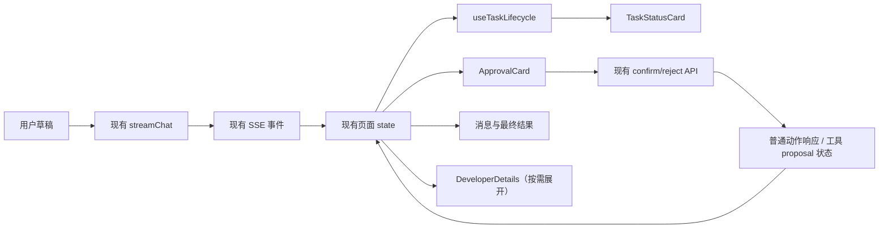

# Safe Agent Workspace Design

## 背景

SpringClaw 已经具备流式对话、运行 trace、普通动作 proposal、高风险工具 proposal、登录鉴权和工具执行结果等能力。但 `frontend/src/views/AgentView.vue` 同时承担聊天、运行控制台、资源浏览和开发排障职责。默认页面将 trace、工具、记忆、日志和资源导航与聊天并列，普通使用者难以回答三个最基本的问题：任务是否已经开始、现在需要我做什么、最终结果在哪里。

本次改动把已有能力收敛成一条可完成的安全任务路径，而不增加新的 Agent 引擎、记忆能力、渠道或后端执行协议。

## 目标与非目标

### 目标

- 让已登录用户能够从一个清晰入口提交任务，并持续理解当前任务状态。
- 在普通动作和高风险工具动作需要用户介入时，展示一致、可理解、可确认或拒绝的审批卡片。
- 在任务结束后，明确展示完成、失败、取消或等待确认，及最终可读结果。
- 保留 trace、工具、记忆和日志的排障价值，但不让它们成为默认使用界面。
- 确保桌面和移动端都优先保证消息、状态和审批操作的可见性。

### 非目标

- 不合并或替换现有的 `AgentEngine`、OPAR、Simplified 或其他运行引擎。
- 不修改 SSE 事件协议、proposal 状态机、工具风险策略或后端鉴权模型。
- 不新增会话、记忆、渠道、运营后台或模型管理功能。
- 不将开发者详情另建成独立路由；本阶段继续复用现有 Agent 页面和数据加载逻辑。

## 产品决策

目标用户是使用内部研发工具完成任务的人员，而不是需要理解 Agent 运行时细节的操作者。默认界面应表现为“任务工作台”，开发运行时信息作为按需打开的详情。

已评估的方案：

1. 只修改样式和文案：变更快，但保留一个混杂的大控制台，无法消除用户的路径困惑。
2. 在现有页面内建立任务工作台默认层，并将开发信息收起：复用现有事件、审批接口和资源加载，交付风险低，能够完整改善主路径。**本次采用。**
3. 将任务工作台和运行控制台拆成两个新路由：长期边界最清晰，但会重复状态管理和 API 编排，超出本次体验收敛范围。

## 使用路径和界面结构

默认路径固定为：

`登录 → 输入任务 → 查看状态 →（如有风险）确认或拒绝 → 查看结果 →（必要时）打开开发者详情`

`AgentView` 保留为页面编排层，并拆出职责单一的前端组件或 composable：

| 单元 | 职责 | 依赖 |
| --- | --- | --- |
| `TaskWorkspace` | 默认工作台布局、消息区、输入区、任务摘要和结果区 | 已有聊天 state 与发送函数 |
| `TaskStatusCard` | 将本次运行转成用户状态、说明和已用时间 | `busy`、SSE trace、审批 state、流结束信号 |
| `ApprovalCard` | 渲染普通动作或工具动作的待确认信息，调用已有确认/拒绝接口 | `pendingAction`、`pendingToolAction`、现有 API |
| `DeveloperDetails` | 默认折叠的 trace、工具、记忆、日志和运行资源 | 现有 inspector/resource state |
| `useTaskLifecycle` | 从发送、SSE、审批、工具 proposal 查询、完成与错误事件导出稳定的任务生命周期 | 现有 stream handler、trace state 与 proposal API |

组件边界必须避免引入第二套聊天、SSE 或 proposal 状态：页面现有的 `messages`、`traceEvents`、`pendingAction`、`pendingToolAction` 和 API 调用仍是唯一数据来源。拆分的目的仅是让呈现和生命周期判断可读、可测试。

## 登录与输入

- 未登录状态不应呈现“可直接发送、发送后才失败”的假象。任务输入区显示明确的登录提示和登录按钮，并通过现有 `LoginPanel` 完成登录。
- 用户在登录前输入的草稿保存在页面内存中；登录成功后保持草稿，不自动发送，用户自行确认发送。
- 登录完成后输入区获得焦点；若登录失败，草稿与错误提示均保留。
- 已登录但正在执行、等待确认或请求终止时，输入区应使用明确原因禁用，不能只呈现无解释的不可输入状态。

## 任务生命周期

`useTaskLifecycle` 维护单次任务的显示状态。它不是新的后端状态机，而是现有事件的确定性 UI 投影。

| 显示状态 | 进入条件 | 对用户显示 | 退出条件 |
| --- | --- | --- | --- |
| `idle` | 没有正在进行的请求 | “可以描述你要完成的任务” | 用户发送 |
| `preparing` | 请求已提交、尚未收到有效 trace | “正在理解任务” | 收到 trace、审批、结果或错误 |
| `running` | 收到正常 trace 或流式内容 | “正在处理任务”及最新可读步骤 | 等待审批、完成或失败 |
| `awaiting_approval` | 收到 `action_required` 或 `tool_action_required` | “需要你的确认，确认前不会执行” | 用户确认/拒绝或 proposal 终态返回 |
| `executing_approved_tool` | 工具 proposal 确认接口返回 `EXECUTING` | “已确认，正在安全执行” | proposal 变为终态或进入 `status_unknown` |
| `completed` | 流正常结束且没有待处理审批、普通动作确认接口返回最终消息，或工具 proposal 为 `EXECUTED` | “任务已完成”及结果 | 下一次发送 |
| `failed` | SSE/请求失败、trace 明确失败且没有成功终态，或工具 proposal 为 `FAILED` | “任务未完成”及可读错误 | 重试或下一次发送 |
| `cancelled` | 用户拒绝 proposal，或工具 proposal 为 `REJECTED`、`EXPIRED` 或 `CANCELLED` | “已拒绝或未执行风险动作” | 下一次发送 |
| `status_unknown` | 工具状态连续三次查询失败，或连续轮询 5 分钟仍未到达终态 | “暂时无法确认最终状态”及重新查询入口 | 查询得到终态或开始新任务 |

优先级为：`awaiting_approval` 高于 `running`，`executing_approved_tool` 高于已结束的原聊天流，`failed` 高于任何 trace 推测的 completed，明确的流结束或最终回复高于“已有 trace 即 completed”的旧推测。这样可避免任务已经结束而仍展示运行中，或只因产生过 trace 就误报完成。

状态卡显示从发送时刻开始的真实墙钟耗时；trace 内各步骤耗时仅用于开发者详情，不再作为“任务用时”相加，避免并行或重复事件造成错误总时长。

## 审批体验

普通动作和工具动作使用同一张审批卡，但保留各自现有确认接口：

- 标题说明“需要确认的操作”，而非内部 proposal 名称。
- 展示操作摘要、影响目标、风险等级和“确认前不会执行”的安全承诺。
- 普通动作调用已有 `confirmActionProposal` / `cancelActionProposal`；工具动作调用已有 `confirmToolProposal` / `rejectToolProposal`。
- 提交中禁止重复点击，并在卡片内显示成功、拒绝或失败结果。
- 默认不展示 proposal ID、request ID、脏工作区、Git SHA 等内部元数据；这些信息移入开发者详情和既有“确认单”资源页。
- 普通动作确认接口返回的 `message`/`result` 是该动作的最终反馈，确认后直接进入 `completed`；普通动作取消后进入 `cancelled`。
- 工具 proposal 确认后，现有后端会异步执行，原 SSE 连接不会恢复。前端必须使用已有的 `GET /api/tool-proposals/{proposalId}` 查询真实状态：在 `EXECUTING` 时每秒查询一次，最多 5 分钟；进入 `EXECUTED`、`FAILED`、`REJECTED`、`EXPIRED` 或 `CANCELLED` 时停止。轮询在离开页面、新建会话或开始新任务时取消。
- 工具执行完成时，状态卡使用 proposal 的 `executionResult`、`executionError`、`previewSummary` 和变更摘要展示真实结果；如果结构化结果不能解析，显示服务端返回的受限摘要而不编造内容。连续三次查询失败或达到 5 分钟后，显示“无法确认最终状态”，提供“重新查询状态”和“查看开发者详情”，但不把结果误标为成功。
- 工具拒绝成功后进入 `cancelled`，并保留当前会话消息和审批决定。

审批卡必须直接从 SSE 待确认事件驱动，不要求用户跳到资源页查找确认单。

## 结果、错误和开发者详情

- 最终 assistant 消息是结果的主要呈现位置。状态卡在结束时给出简洁摘要并提供“查看开发者详情”入口，不复制或伪造模型结果。
- 流异常、超时、缺少 proposal ID、确认接口失败和后端返回错误都必须在状态卡或审批卡给出下一步动作，例如“重试”“重新发起任务”或“拒绝并返回”。
- Trace、工具、记忆和日志保留现有数据和标签，但放在默认收起的 `DeveloperDetails` 中。用户可显式展开；展开状态只影响展示，不能改变任务执行。
- 原有运行资源导航继续可用，但不与默认聊天任务区争夺首屏空间。移动端默认不展示开发者详情。

## 响应式与可访问性

- 桌面端将任务区作为主列；详情区收起后不占用消息区宽度。
- 窄屏下消息区与输入区优先，审批卡位于当前任务消息之后，所有确认与拒绝按钮保持可见且可点击。
- 状态变化、审批到达、确认结果和请求错误使用 `aria-live` 通知；卡片标题、按钮和详情开关使用明确中文标签。
- 颜色不能是唯一状态信号；每种状态必须有文字和图标或形状提示。

## 数据流与兼容性

后端 API、SSE event 名称、`AgentTraceEvent`、proposal DTO 和认证 store 均保持兼容。工具完成状态复用已经存在的单条 proposal 查询接口，不新增后端端点。若后端事件没有提供足够信息，页面使用现有安全降级文案，不通过推测生成虚假的执行结果或风险描述。

## 实施顺序

1. 为生命周期投影和审批展示建立可测试的纯逻辑/组件边界，并保持现有流式请求和 API 调用不变。
2. 实现登录前门禁、草稿保留、任务状态卡、结果/错误呈现和统一审批卡。
3. 将现有 inspector/resource 内容移动或封装为默认收起的开发者详情，删除默认控制台噪音。
4. 调整桌面与窄屏布局，进行可访问性与键盘操作检查。
5. 通过类型检查、前端构建、交互冒烟测试和后端 Maven 全量回归验证；提交并推送。

## 验收标准

1. 未登录用户不能误以为任务已经发送；登录后草稿仍在且由用户手动发送。
2. 普通任务至少依次可见“理解/处理中”和明确的完成或失败终态，结果在消息区可读。
3. 收到普通或工具审批 SSE 事件时，任务区立即出现可读审批卡；确认、拒绝分别调用现有正确接口，并更新用户状态。工具确认后能从现有 proposal 查询接口取得 `EXECUTED`、`FAILED` 或未能确认的真实终态。
4. proposal ID 等内部信息默认不占据主任务路径，仍可在开发者详情或确认单资源中查看。
5. trace、工具、记忆、日志仍可打开，且不会因为展开/收起改变正在运行的任务。
6. 在窄屏尺寸，消息、输入和审批按钮都不被详情区遮挡或挤出可视区域。
7. 前端 `typecheck` 与 `build` 通过；相关后端与全量 Maven 测试通过；交互冒烟覆盖登录门禁、正常完成、审批确认、审批拒绝和失败展示。
